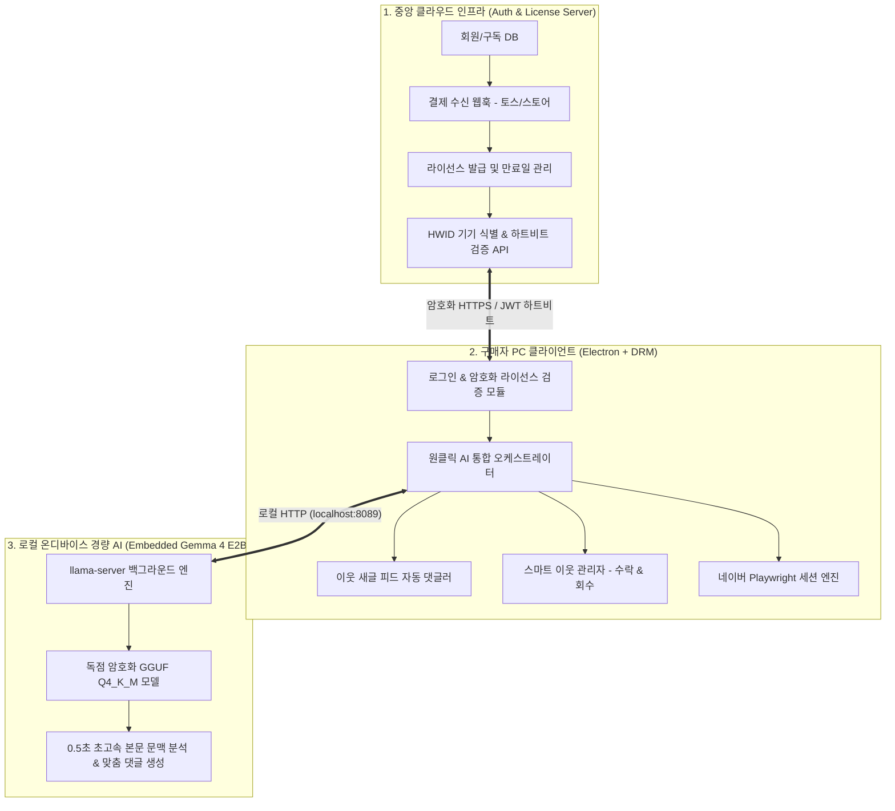

# 📑 [마스터 가이드] 상용 AI 블로그 솔루션 프로젝트 종합 개요

> **프로젝트 코드명**: 이웃메이트 AI Pro (NeighborMate AI Pro)  
> **소프트웨어 라이선스**: **100% 비공개 독점 상용 소프트웨어 (Closed-Source Commercial Software)**  
> **비즈니스 모델**: **월 9,900원 ~ 14,900원 유료 월 구독제 (Paid Subscription Only)**  
> **핵심 차별화**: 자잘한 수동 조작을 배제한 **'1-Click AI 전자동 자율 에이전트' + 초경량 온디바이스 AI (Gemma 4 E2B 맞춤 파인튜닝)**  
> **문서 버전**: v2.0 (상용화 마스터 플랜)  
> **최종 수정일**: 2026년 9월 6일

---

## 1. 프로젝트 비전 및 제품 목표

본 솔루션은 크몽 1위 네이버 블로그 프로그램(월 25,000원 고가 상품)의 시장 점유율을 탈환하기 위해 기획된 **초가성비 고지능 AI 전자동 블로그 성장 솔루션**입니다.

* **🎨 최우선 개발 원칙: 사용자 편의 & 깔끔하고 보기 좋은 UX/UI 극대화**:
  * 복잡한 기술적 파라미터를 배제하고, 초보자도 3초 만에 이해하는 **1-Click 심플 인터페이스**를 유지한다.
  * 넉넉한 여백, 카드형 레이아웃, 모던한 폰트와 감각적인 비주얼로 **"쓰기 편하고 보기에 깔끔한 화면"**을 구현한다.
  * 진행 중인 AI 작업 상태, 구독 디데이, 소통 성공률을 직관적인 뱃지와 토스트로 명확히 피드백한다.
* **완전 유료화 & 불법 복제 방지**: 매월 구독료를 결제한 인증 고객만 사용 가능하며, 1인 1PC 하드웨어 락(HWID) 및 코드 난독화(Bytenode V8 컴파일)가 적용됩니다.
* **0원 API 비용 & 저사양 PC 지원**: 자체 파인튜닝한 **Gemma 4 E2B** 초경량 모델을 내장하여 구매자의 일반 사무용 노트북에서도 0.5초 만에 센스 있는 한국어 댓글을 생성하며, 개발사 측의 API 서버 비용은 0원입니다.

---

## 2. 문서 체계 (Documentation Suite)

프로젝트의 성공적인 상용 출시를 위해 총 5개의 전문 명세서로 구성되어 있습니다:

| 번호 | 문서명 | 주요 내용 | 링크 |
| :---: | :--- | :--- | :---: |
| **EXEC**| **통합 실행 Task 계획서** | **전체 5단계 순차 업무 Task, 파일 단위 구현 방법, 완료 정의(DoD)** | [TASK_MASTER_PLAN.md](file:///D:/work/dev/blog/docs/TASK_MASTER_PLAN.md) |
| **00** | **마스터 종합 개요** (현재 문서) | 프로젝트 비전, 3계층 아키텍처, 4주 출시 로드맵 | [00_OVERVIEW.md](file:///D:/work/dev/blog/docs/00_OVERVIEW.md) |
| **01** | **비즈니스 & PRD 기획서** | 크몽 95782 벤치마킹, 요금제(월 9,900원/14,900원), 마케팅 전략 | [01_BUSINESS_AND_PRD.md](file:///D:/work/dev/blog/docs/01_BUSINESS_AND_PRD.md) |
| **02** | **AI 모델 파인튜닝 명세서** | Gemma 4 E2B 학습, 10만건 데이터셋, DPO 보상 모델, GGUF 양자화 | [02_AI_MODEL_FINETUNING.md](file:///D:/work/dev/blog/docs/02_AI_MODEL_FINETUNING.md) |
| **03** | **라이선스 & 보안 서버 설계서** | 중앙 인증 서버, 1인 1PC HWID 바인딩, 결제 웹훅 연동, Bytenode DRM | [03_AUTH_LICENSE_SERVER.md](file:///D:/work/dev/blog/docs/03_AUTH_LICENSE_SERVER.md) |
| **04** | **클라이언트 핵심 기능 명세서** | 이웃 새글 자동 댓글, 받은 신청 AI 수락, 장기 미수락 신청 회수 | [04_CLIENT_FEATURE_SPEC.md](file:///D:/work/dev/blog/docs/04_CLIENT_FEATURE_SPEC.md) |
| **05** | **크몽 95782 기능 심층 비교 보고서** | 원본 상세 기능 매트릭스, 크몽 솔루션 기능 전수 조사 및 세부 분석 | [05_KMONG_95782_COMPETITOR_ANALYSIS.md](file:///D:/work/dev/blog/docs/05_KMONG_95782_COMPETITOR_ANALYSIS.md) |

---

## 3. 전체 시스템 3계층 아키텍처



---

## 4. 4주 상용 출시 마일스톤 (Milestone Roadmap)

```
[1주차] 클라이언트 핵심 기능 구현 & UI 간소화
  ├── 이웃 새글 피드(FeedList) 실시간 감지 및 자동 댓글
  ├── 받은 서로이웃 신청 AI 선별 자동 수락
  ├── 오래된 보낸 신청(7~14일) 일괄 자동 회수
  └── 1-Click AI 전자동 오토파일럿 3탭 심플 UI 완성

[2주차] 중앙 라이선스 & 결제 인증 서버 구축 (우선순위 격상)
  ├── 회원가입/로그인 API 및 1인 1PC HWID 기기 지문 락
  ├── 토스페이먼츠/스마트스토어 결제 자동 연동 웹훅
  └── 클라이언트 Bytenode V8 바이트코드 컴파일 & DRM 패키징

[3주차] Gemma 4 E2B AI 모델 파인튜닝 & GGUF 온디바이스 패키징
  ├── 네이버 인기 블로그 10만건 크롤링 & 데이터셋 정제
  ├── Gemma 4 E2B LoRA SFT 및 DPO 학습
  └── GGUF Q4_K_M 변환 및 0.5초 추론 벤치마크 완료

[4주차] 비공개 베타 테스트 & 상용 런칭
  ├── 일반 사무용 저사양 노트북 구동 안정성 검증
  ├── 실 결제 및 정기 구독 라이선스 연동 실전 테스트
  └── 크몽 / 네이버 스마트스토어 / 블로그 마케팅 커뮤니티 정식 판매 개시
```
