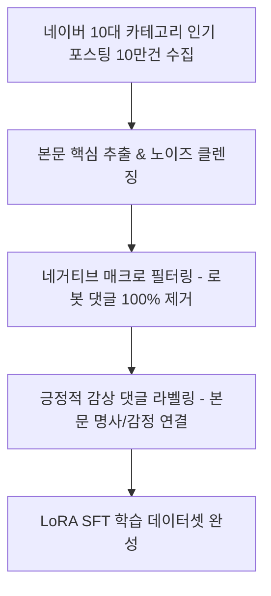

# 🧠 [AI 명세서] Gemma 4 E2B 파인튜닝 및 온디바이스 서빙

> **문서 코드**: SPEC-02-AI  
> **기반 모델**: Google Gemma 4 E2B (2B급 초경량 모델)  
> **핵심 목표**: 저사양 PC(내장 그래픽/CPU)에서도 0.5초 내에 자연스러운 블로그 댓글 생성  
> **최종 수정일**: 2026년 9월 6일

---

## 1. 모델 선정 근거 및 하드웨어 목표치

| 항목 | 기존 일반 대형 모델 (7B~14B) | **자체 파인튜닝 Gemma 4 E2B** |
| :--- | :--- | :--- |
| **GGUF Q4 파일 크기** | 4.5GB ~ 8.5GB (다운로드 부담) | **약 1.2GB ~ 1.5GB (1분 내 다운로드)** |
| **필요 VRAM** | 최소 6GB ~ 12GB 필수 | **VRAM 2GB 미만 또는 CPU(AVX2) 단독 구동** |
| **추론 속도 (일반 PC)** | 2.5초 ~ 6초 | **0.3초 ~ 0.8초 (체감상 즉각 생성)** |
| **한국어 감성 소통력** | 번역투, 범용 문장 위주 | **네이버 블로그 찐이웃 감성 100% 적합** |

---

## 2. 학습 데이터셋 구축 파이프라인 (10만 건)

### 2.1 카테고리 구성 (총 100,000 페어)
1. **맛집 / 카페 / 디저트** (20,000건): 비주얼, 맛 표현, 위치 언급, 재방문 의사.
2. **일상 / 생각 / 육아** (20,000건): 공감, 위로, 응원, 따뜻한 가족적 유대감.
3. **뷰티 / 패션 / 헬스** (15,000건): 제형, 발색, 핏감, 운동 루틴 칭찬.
4. **IT / 테크 / 전자기기** (15,000건): 스펙, 성능 체감, 가성비, 디자인 평가.
5. **국내외 여행 / 숙소** (15,000건): 풍경 칭찬, 일정 문의, 힐링 감성.
6. **살림 / 요리 / 인테리어 / 원예** (15,000건): 꿀팁 감탄, 레시피 따라하기, 감성 인테리어.

### 2.2 네거티브 데이터 (Negative Reject Data)
학습 시 아래 패턴은 감점 페널티(-1.0)를 부여하여 모델이 절대 생성하지 않도록 억제:
* *"좋은 포스팅 잘 보고 갑니다"*
* *"유익한 정보 감사합니다 서이추 신청해요"*
* *"공감 누르고 가요 제 블로그도 놀러오세요"*
* *"오늘도 좋은 하루 보내세요"* (단독 사용 금지)

### 2.3 포지티브 데이터 (Positive Preferred Data)
본문 속 핵심 명사와 맥락을 정확히 짚어주는 2~3문장:
* *"성수동 골목에 이런 베이커리 카페가 숨어있었군요! 소금빵 단면 버터 동굴이 대박이라 보기만 해도 고소해 보여요. 이번 주말에 지도에 저장해두고 꼭 가봐야겠어요 :)"*

---

## 3. 학습 및 배포 파이프라인 (SFT + DPO)

### 3.1 SFT (Supervised Fine-Tuning)
* **프레임워크**: Unsloth / HuggingFace TRL (빠른 학습 및 VRAM 절약)
* **기법**: LoRA (r=16, lora_alpha=32, target_modules: q, k, v, o, gate, up, down proj)
* **에포크 / 배치**: 3 Epochs, Cosine Learning Rate Schedule (2e-4)

### 3.2 DPO (Direct Preference Optimization)
* 모델이 매크로성 답변 대신 **구체적 명사를 포함한 진정성 있는 답변을 선택하도록 보상 모델 최적화**.

### 3.3 GGUF 양자화 & DRM 헤더 암호화
1. LoRA 모델 가중치를 베이스 Gemma 4 E2B에 병합.
2. `llama.cpp` 양자화 스크립트로 `gemma-4-e2b-blog-v2.Q4_K_M.gguf` 생성.
3. **독점 가중치 보호**: 파일 헤더에 256비트 AES 암호화를 적용하여, 당사 정품 프로그램 실행 시 메모리 상에서만 복호화되어 로드되도록 보호.
