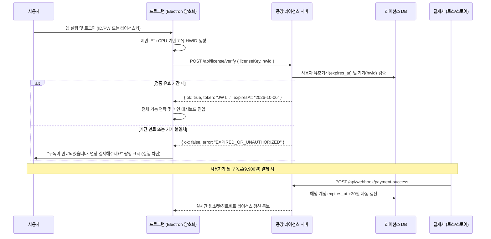

# 🔐 [서버/보안] 중앙 라이선스 인증 & DRM 아키텍처 명세서

> **문서 코드**: SPEC-03-SECURITY  
> **제품 원칙**: **결제 완료된 정품 유료 라이선스만 실행 허용 (Anti-Piracy 100%)**  
> **핵심 기술**: HWID 기기 지문 바인딩, JWT 세션, 결제 자동 웹훅, Bytenode V8 컴파일  
> **최종 수정일**: 2026년 9월 6일

---

## 1. 라이선스 인증 및 결제 흐름도



---

## 2. 1인 1PC 불법 공유 방지 (HWID Fingerprinting)

프로그램을 복사해 여러 컴퓨터에서 쓰는 것을 막기 위해 하드웨어 고유값을 결합합니다.

### 2.1 HWID 생성 알고리즘
```javascript
// lib/hardware-fingerprint.js
import { machineIdSync } from 'node-machine-id';
import crypto from 'node:crypto';
import os from 'node:os';

export function generateClientHwid() {
  const rawId = [
    machineIdSync({ original: true }), // OS UUID
    os.cpus()[0]?.model || 'UNKNOWN_CPU',
    os.totalmem()
  ].join(':::');

  return crypto.createHash('sha256').update(rawId).digest('hex');
}
```

### 2.2 기기 제한 정책
* 최초 로그인 시 해당 `hwid`가 서버 DB의 사용자 계정에 바인딩.
* 다른 PC에서 동일 계정으로 접속 시: `"등록된 PC가 아닙니다. 기기 변경은 월 1회 가능합니다."` 안내와 함께 차단.

---

## 3. 결제 자동 연동 웹훅 (Payment Webhooks)

* **토스페이먼츠 / 스마트스토어 API 연동**:
  * 결제 완료 이벤트 수신 시 `orderId` 또는 `customerEmail` 조회.
  * 해당 유저의 `expires_at` 타임스탬프를 `현재 시점 + 30일`로 자동 연장.
  * 사용자가 별도로 관리자에게 연락할 필요 없이 즉시 프로그램이 연장됨.

---

## 4. 클라이언트 바이너리 보호 & 소스코드 비공개 (DRM)

* **Bytenode (V8 바이트코드 컴파일)**:
  * 모든 핵심 비즈니스 로직(`naver.js`, `automation.js`, `llm.js`)을 순수 텍스트 .js가 아닌 **V8 바이너리 바이트코드(.jsc)**로 컴파일하여 배포.
  * 소스코드 디컴파일 및 수정 크랙(Crack)을 100% 무력화.
* **Electron ASAR 무결성 서명**:
  * ASAR 아카이브 변조 감지 시 프로그램 자동 종료.
