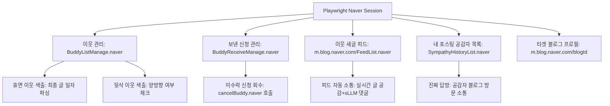

# 📊 네이버 블로그 이웃 관리 솔루션 벤치마킹 및 기능 확장 분석 보고서

> **분석 대상**: 크몽 블로그 마케팅 솔루션 부문 1위 **[MJsoft - 블로그이웃 UL (#지능형소통 #답방 스스로 하는 블로그 이웃관리 솔루션)](https://kmong.com/gig/95782)**  
> **비교 대상**: 자체 개발 로컬 AI 기반 **이웃메이트 Engage (`apps/engagement`)**  
> **작성 일자**: 2026년 9월 6일  
> **목적**: 상용 1위 제품의 실전 상업적 기능과 사용자 니즈를 파악하여, 현재 프로그램에 추가해야 할 핵심 기능 목록 및 구현 방안 도출

---

## 1. 벤치마킹 대상 솔루션 개요 (크몽 gig/95782)

| 항목 | 크몽 '블로그이웃 UL' (MJsoft) | 현재 '이웃메이트 Engage' (자체) |
| :--- | :--- | :--- |
| **판매가 / 라이선스** | 월 25,000원 / 6개월 10만원 / 1년 18만원 (구독형) | **100% 독점 상용 유료 월 구독제 (Closed-Source SaaS)** |
| **실행 환경** | 로컬 PC 설치형 프로그램 (Windows) | 로컬 PC 설치형 (Node.js + Electron + Playwright) |
| **댓글 생성 엔진** | 규칙 기반 + 경량 API / 템플릿 문구 조합 | **로컬 sLLM (RTX 5080 온디바이스 Gemma 4 12B)** |
| **누적 판매 / 평점** | 13,800+ 거래, 2,589개 리뷰, 평점 4.97/5.0 | 자체 블로그 및 마케팅 전용 커스텀 개발 |
| **핵심 포지셔닝** | 10년 노하우 기반의 안전 소통 + 이웃 5,000명 한도 정리 | **0원 비용 고지능 AI 소통 + 포스팅/이미지 통합 자동화** |

---

## 2. 종합 기능 비교 매트릭스 (Feature Matrix)

| 구분 | 세부 기능 | 크몽 UL (95782) | 현재 이웃메이트 | 현황 분석 및 보완 방향 |
| :---: | :--- | :---: | :---: | :--- |
| **타겟 발굴** | 키워드 검색 기반 이웃 발굴 | ✅ 지원 | ✅ 지원 | 현재 프로그램도 상위 랭킹 블로그 수집 완벽 지원 |
| | 실시간 트렌드/카테고리별 검색 | ✅ 지원 | ✅ 지원 | 현재 프로그램은 네이버 크리에이터 어드바이저 트렌드까지 연계 |
| | **경쟁사/유명 블로그 이웃 추출** | ✅ 지원 | ❌ 미지원 | **[추가 필요]** 특정 타겟 블로그의 이웃 목록을 긁어와 이웃 맺기 |
| | **외부 ID 리스트(엑셀/TXT) 등록** | ✅ 지원 | ❌ 미지원 | **[추가 필요]** 카페 유저, 인스타 유입 등 수집된 ID 일괄 작업 |
| | **정밀 필터 (활동성/방문자수/글수)** | ✅ 지원 | ⚠️ 부분 지원 | **[보완 필요]** 일 방문자수, 최근 작성일(3~7일내) 정밀 필터 |
| **소통 자동화** | 공감(❤️) 자동 클릭 | ✅ 지원 | ✅ 지원 | Playwright 기반 안정적 클릭 지원 |
| | 문맥 기반 지능형 코멘트 | ⚠️ 경량/API | ✅ **압도적 우위** | 로컬 RTX 5080 Gemma 4 12B로 비용 없이 자연스러운 한국어 |
| | **기존 이웃 새글 피드 순회 소통** | ✅ 지원 | ❌ 미지원 | **[추가 필요]** 내 이웃 피드(`FeedList`) 새 글 읽고 자동 공감/댓글 |
| | **네이버 이웃 그룹별 선택 소통** | ✅ 지원 | ❌ 미지원 | **[추가 필요]** 특정 그룹(예: '서로이웃', '소통단')만 지정 소통 |
| | **진짜 답방 (상대 블로그 방문 댓글)** | ✅ 지원 | ⚠️ 대댓글만 지원 | **[추가 필요]** 내 글에 공감/댓글 남긴 사람의 최신글로 역방문 답방 |
| | **공감(하트) 누른 사용자 목록 수집** | ✅ 지원 | ❌ 미지원 | **[추가 필요]** 댓글뿐만 아니라 하트 누른 블로거에게도 답방 소통 |
| **이웃 정리** | **장기 휴면(유령) 이웃 색출·삭제** | ✅ 지원 | ❌ 미지원 | **[최우선 추가]** 30~90일 글 없는 이웃 자동 언팔로우 |
| **(5천명 한도)** | **나만 추가한 이웃 (뒷삭 계정) 색출** | ✅ 지원 | ❌ 미지원 | **[최우선 추가]** 나는 이웃이나 상대방이 나를 지운 계정 정리 |
| | **보낸 서로이웃 신청 일괄 회수** | ✅ 지원 | ❌ 미지원 | **[최우선 추가]** 500건 한도 도달 방지, 미수락 신청 일괄 취소 |
| | **받은 신청 스팸 필터링·선별 수락** | ✅ 지원 | ❌ 미지원 | **[추가 필요]** 광고/스팸 신청 자동 거절, 유효 신청 일괄 수락 |
| **문구 관리** | 커스텀 문구 풀 (랜덤 로테이션) | ✅ 지원 | ❌ 미지원 | **[추가 필요]** 사용자가 등록한 인사말/시그니처 풀 활용 |
| | 스핀텍스 (`{안녕|반가워}`) 지원 | ✅ 지원 | ❌ 미지원 | **[추가 필요]** 정형화된 패턴 방지용 스핀텍스 믹서 |
| **계정·보안** | 로컬 PC 실행 & 인간 행동 모사 | ✅ 지원 | ✅ 지원 | 사람과 동일한 랜덤 지터(120~180초), 10회 주기 쿨다운 적용 |
| | 서로이웃 일일 100건 쿼터 보호 | ✅ 지원 | ✅ 지원 | 100건 도달 시 자동 중단 및 자정 롤오버 자동 리셋 탑재 |
| | **다중 계정 프로필 스위처** | ✅ 지원 | ⚠️ 수동 전환 | **[추가 권장]** 복수 블로그 순차 자동 전환 실행 |
| | 프록시 IP / 테더링 IP 지원 | ✅ 지원 | ❌ 미지원 | 필요 시 프록시 설정 지원 가능 |
| **종합 확장** | AI 블로그 포스팅 & 이미지 생성 | ❌ 미지원 | ✅ **독보적 우위** | 실시간 트렌드 글 자동 생성, ComfyUI/Imagen 비주얼 카드 생성 |

---

## 3. 현재 우리 프로그램의 독보적 차별점 (우위 요소)

1. **비용 0원(Zero-Cost) 온디바이스 sLLM 엔진**:
   - 상용 솔루션은 유료 클라우드 API를 쓰거나 단순 룰베이스 조합 문구를 사용합니다.
   - 우리는 로컬 RTX 5080 GPU에서 실행되는 **Gemma 4 12B / Qwen 2.5**를 내장하여 API 비용이 0원이며, 3가지 맞춤 톤(친근 이웃체, 정중 소통체, 열정 칭찬형)으로 사람이 직접 쓴 것보다 더 진정성 있는 2~3문장 댓글을 생성합니다.
2. **포스팅 제작·이미지 생성·소통 통합 올인원 파이프라인**:
   - 크몽 프로그램은 오직 '이웃 소통'만 지원하지만, 우리 프로그램은 **실시간 트렌드 분석 → SEO 최적화 글 작성 → ComfyUI/Imagen 고화질 비주얼 카드 생성 → 스마트에디터 원클릭 발행 → 발행 후 댓글/이웃 관리**까지 하나의 앱에서 완결됩니다.
3. **네이버 최신 안티어뷰징 우회 메커니즘 탑재**:
   - 120~180초의 가변 지터 딜레이, 10건 작업 후 10~20분 안전 휴식 쿨다운, 일일 100건 쿼터 도달 시 자동 신청 차단 및 자정 롤오버가 이미 구현되어 있습니다.

---

## 4. 신규 추가해야 할 핵심 기능 상세 분석 (우선순위별)

### 🥇 Priority 1: 이웃 정리 & 신청 회수 시스템 (가장 시급한 필수 기능)

> **배경**: 네이버 블로그는 **이웃 수가 최대 5,000명**으로 제한되어 있으며, **내가 보낸 서로이웃 신청도 대기 건수(보통 500건) 제한**이 있습니다. 오래 운영한 블로그는 활동 없는 유령 이웃이 차서 새 이웃을 맺지 못하는 병목이 발생합니다. 크몽 95782의 가장 큰 셀링 포인트 중 하나입니다.

#### 1. 장기 휴면(유령) 이웃 색출 및 자동 정리
- **기능 설명**:
  - 내 이웃 목록(`https://admin.blog.naver.com/BuddyListManage.naver`)을 스크랩하여 각 이웃 블로그의 **최근 포스팅 일자**를 조회합니다.
  - 필터 옵션: 최근 30일 / 60일 / 90일 / 180일 이상 새 글이 없는 블로그를 '휴면 이웃'으로 분류.
  - 선택한 휴면 이웃들을 안전 딜레이를 두고 일괄 이웃 해제(언팔로우).

#### 2. 나만 추가한 일방 이웃 (나를 뒷삭한 이웃) 색출 및 삭제
- **기능 설명**:
  - '내가 추가한 이웃' 목록과 '나를 추가한 이웃' 목록을 크로스 체크(Cross-check).
  - 나는 이웃으로 등록해 두었으나, 상대방이 나를 삭제(뒷삭)하여 일방적인 이웃 관계가 된 계정을 색출.
  - 클릭 한 번으로 일괄 정리하여 내 5,000명 슬롯을 회생.

#### 3. 보낸 서로이웃 신청 중 장기 미수락 신청 일괄 취소 (회수)
- **기능 설명**:
  - `https://admin.blog.naver.com/BuddyReceiveManage.naver?orderType=addDate` (보낸 신청 관리 페이지) 접속.
  - 신청을 보낸 지 7일~14일 이상 지났으나 상대방이 수락하지 않고 방치한 대기 목록을 스크랩.
  - 일괄 '신청 취소' 버튼을 실행하여 네이버 보낸 신청 한도(500건)를 확보.

#### 4. 받은 서로이웃 신청 스마트 필터 & 선별 수락
- **기능 설명**:
  - 나에게 들어온 서로이웃 신청 목록 조회.
  - 스팸/광고성 기본 멘트("우리 서로이웃해요~", 광고 대행사 문구)를 자동 감지하여 일괄 거절 처리.
  - 진정성 있는 멘트나 특정 관심사 블로거만 원클릭으로 일괄 수락.

---

### 🥈 Priority 2: 소통 채널 다양화 및 진짜 답방 (소통 성공률 극대화)

#### 1. 기존 이웃 새글 피드(Feed) 순회 소통
- **기능 설명**:
  - 네이버 모바일 이웃 새글 피드(`https://m.blog.naver.com/FeedList.naver`) 접속.
  - 이미 맺어진 내 이웃들이 갓 발행한 새 글을 순회하며 공감(❤️) + 로컬 sLLM 지능형 댓글을 작성.
  - **효과**: 신규 이웃만 찾는 것보다, 기존 이웃과의 유대감을 높여 내 블로그 포스팅 시 즉각적인 맞공감/맞댓글 방문율이 3~5배 증가.

#### 2. 네이버 이웃 그룹별 선택 소통
- **기능 설명**:
  - 네이버 블로그에 분류된 그룹(예: '서로이웃', '일상/소통', '맛집/리뷰', 'VIP이웃')을 파싱.
  - 사용자가 선택한 특정 그룹의 이웃들만 집중적으로 순회 소통.

#### 3. 내 블로그 방문자/반응자 대상 '진짜 역방문 답방'
- **기능 설명**:
  - 현재는 내 글에 댓글이 달리면 내 블로그에 대댓글만 달아주고 있습니다.
  - **진짜 답방**: 댓글 작성자 및 **공감(좋아요) 누른 사용자**의 블로그 링크를 타고 들어가, 그 블로그의 **최신 글에 직접 공감 + sLLM 문맥 댓글**을 남겨줌.
  - **중복 방지 필터**: 오늘 이미 내가 그 사람 글에 댓글을 달았다면 자동으로 스킵.

#### 4. 경쟁사 / 인플루언서 블로그 이웃 타겟팅
- **기능 설명**:
  - 타겟 블로그 URL 또는 ID 입력 (예: 나와 유사한 주제의 파워블로거/인플루언서 블로그).
  - 해당 블로그의 이웃 목록 또는 최근 포스팅에 댓글을 남긴 활성 유저 목록을 크롤링하여 내 타겟 큐에 등록.
  - **효과**: 불특정 다수보다 내 분야에 실제 관심이 높고 활동적인 블로거들만 핀포인트로 타겟팅 가능.

#### 5. 사용자 지정 외부 ID 목록 일괄 등록 (TXT / CSV 파일)
- **기능 설명**:
  - 네이버 카페 회원 목록, 엑셀 정리 리스트, 텍스트 파일에 적힌 네이버 아이디 목록을 드래그&드롭으로 업로드.
  - 해당 ID 목록을 대상으로 순차적인 서로이웃 신청 + 최신글 소통 실행.

---

### 🥉 Priority 3: 댓글 개인화 & 정밀 타겟 필터링 (품질 향상)

#### 1. 커스텀 문구 풀 + 스핀텍스(Spintax) & AI 결합
- **기능 설명**:
  - 로컬 AI가 생성한 댓글 앞/뒤에 사용자가 원하는 멘트나 서명을 결합하는 템플릿 기능.
  - 머리말 예시: `{안녕하세요|반갑습니다|좋은 하루예요} {작성자명}님!`
  - 꼬리말 예시: `오늘도 활기찬 하루 보내세요 :) | 날씨가 쌀쌀한데 감기 조심하세요!`
  - 스핀텍스 구문 분석기를 내장하여 기계적인 반복 패턴을 원천 차단.

#### 2. 블로그 활동성 정밀 필터 (깡통 블로그 필터링)
- **기능 설명**:
  - 이웃 신청 대상 블로그 방문 시 메타데이터 검사:
    - 최근 포스팅 일자: 최근 3일 또는 7일 이내 작성 글이 없는 경우 스킵.
    - 총 누적 포스팅 수: 10개 미만인 신생/테스트 계정 스킵.
    - 일일 방문자 수(Today): 최소 방문자 수 기준(예: 50명 이상) 미달 시 스킵.
    - 상업성 키워드 필터: 제목이나 소개글에 '대출, 보험, 분양, 렌탈, 바이럴' 등 광고 키워드가 포함되면 스킵.

---

### 🎖️ Priority 4: 전문가 & 대행사용 인프라 확장

#### 1. 다중 계정 프로필 스위처 (Multi-Account Profile Switcher)
- **기능 설명**:
  - 여러 개의 네이버 계정(본계정, 서브블로그 1, 2)의 쿠키 및 Playwright 프로필을 독립된 디렉토리에 저장.
  - UI 상단에서 계정을 원클릭으로 전환하거나, 계정 A 50건 작업 후 계정 B로 자동 전환하여 순차 실행.

#### 2. 프록시 IP / 테더링 연동 지원
- **기능 설명**:
  - 다계정 운영 시 네이버 IP 차단 방지를 위한 HTTP/SOCKS5 프록시 주소 설정 필드 제공.
  - 모바일 핫스팟/테더링 환경을 위한 IP 변경 감지 및 알림.

#### 3. 소통 성과 통계 대시보드
- **기능 설명**:
  - 보낸 서로이웃 신청 건수 대비 **수락률(%)**, 답방 후 상대방 재방문율 통계.
  - 일자별/주간별 이웃 순증 그래프 시각화.

---

## 5. 세부 기술 구현 설계서 (Technical Architecture)

### 5.1 네이버 웹 엔드포인트 맵



1. **이웃 관리 엔드포인트**:
   - URL: `https://admin.blog.naver.com/BuddyListManage.naver?blogId={myBlogId}`
   - 기능: 전체 이웃 목록, 그룹별 이웃 목록, 이웃 추가일, 최근 포스팅 확인.
2. **보낸 신청 관리 엔드포인트**:
   - URL: `https://admin.blog.naver.com/BuddyReceiveManage.naver?blogId={myBlogId}&type=send`
   - 기능: 대기 중인 신청 목록, 신청일, 일괄 취소 API 호출 (`cancelBuddy.naver`).
3. **이웃 새글 피드 엔드포인트**:
   - URL: `https://m.blog.naver.com/FeedList.naver`
   - 기능: 모바일 이웃 피드에서 최신 글 목록을 무한 스크롤로 로드하여 공감/댓글 자동화.
4. **공감(좋아요) 누른 사용자 목록**:
   - URL: `https://blog.like.naver.com/v1/services/BLOG/contents/{blogId}_{logNo}/likers`
   - 기능: 내 글에 하트를 누른 네이버 아이디 목록 추출 후 답방 큐에 등록.

### 5.2 백엔드 모듈 구조 확장안 (`apps/engagement/lib`)

```
apps/engagement/lib/
├── naver.js                  # 기존 브라우저 세션 및 스마트에디터
├── naver-neighbor-cleaner.js # [신규] 유령 이웃 색출, 뒷삭 체크, 보낸 신청 취소
├── naver-feed-engage.js      # [신규] 이웃 피드(FeedList) 순회 공감·댓글
├── naver-reciprocal.js       # [신규] 공감자/방문자 역방문 답방 자동화
├── competitor-targeter.js    # [신규] 경쟁 블로그 이웃 및 외부 ID 리스트 파싱
├── spintax.js                # [신규] 스핀텍스 문구 파서 및 템플릿 믹서
├── engagement-automation.js  # 기존 통합 오케스트레이터 (신규 모듈 연결)
└── llm.js                    # 기존 온디바이스 RTX 5080 sLLM 엔진 (유지)
```

---

## 6. 개발 로드맵 및 실행 제안 (Milestone Plan)

### 📌 1단계 (Phase 1): 이웃 정리 & 신청 회수 (가장 높은 체감 가치)
- **목표**: 5,000명 이웃 제한에 걸린 블로거와 500건 신청 대기 한도를 완벽히 해소.
- **구현 과제**:
  1. `BuddyReceiveManage`를 통한 7일 이상 미수락 신청 일괄 취소.
  2. `BuddyListManage`를 통한 60/90일 미활동 유령 이웃 검색 및 선택 삭제.
  3. 나만 추가한 일방 이웃(뒷삭) 필터링.

### 📌 2단계 (Phase 2): 진짜 답방 & 피드 소통 자동화
- **목표**: 내 글에 반응해 준 사람에게 확실한 답방을 가고, 기존 이웃 새글 피드를 챙겨 소통 지수 극대화.
- **구현 과제**:
  1. 내 글의 공감(하트) 누른 사용자 목록 수집.
  2. 상대방 최신글로 역방문하여 sLLM 문맥 댓글 + 공감 작성.
  3. 모바일 `FeedList` 순회 소통 탭 신설.

### 📌 3단계 (Phase 3): 정밀 타겟팅 & 문구 스핀텍스 고도화
- **목표**: 타겟팅 품질과 댓글의 자연스러움 극대화.
- **구현 과제**:
  1. 경쟁사 블로그 이웃 추출 & TXT/엑셀 ID 리스트 불러오기.
  2. 방문자 수/게시글 수/상업성 키워드 제외 필터.
  3. 스핀텍스 템플릿(`{안녕|반가워}`) + 로컬 AI 댓글 합성 기능.

---

## 7. 결론 요약

크몽 1위 솔루션(MJsoft 블로그이웃 UL)은 오랜 운영을 통해 **"이웃 5,000명 한도 관리(유령 이웃 삭제, 보낸 신청 회수)"**와 **"기존 이웃 피드 및 답방 소통"**이라는 블로거들의 가장 절실한 페인 포인트(Pain Point)를 해결함으로써 시장을 장악했습니다.

반면, 우리 **이웃메이트 Engage**는 이미 **로컬 GPU sLLM 기반 0원 고지능 댓글**과 **블로그 포스팅/비주얼 카드 생성 통합**이라는 기술적 우위를 점하고 있습니다.

따라서 위 1단계(이웃 정리 & 보낸 신청 회수)와 2단계(진짜 답방 & 피드 소통)를 신규 기능으로 탑재한다면, **상용 유료 프로그램을 뛰어넘는 완성형 블로그 마케팅 솔루션**으로 완성될 것입니다.
