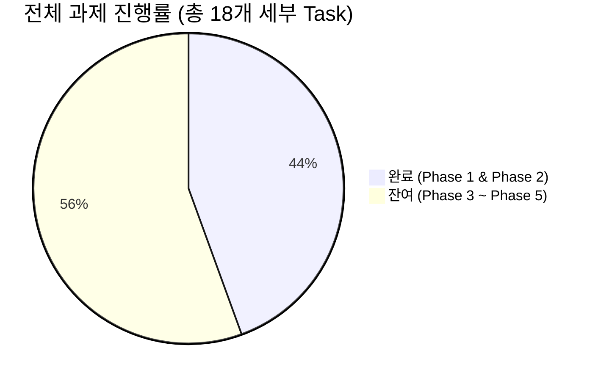
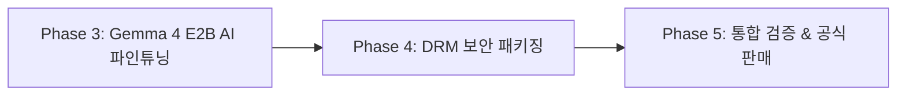

# 📊 [진행 현황 및 잔여 과제] 이웃메이트 솔루션 개발 현황 리포트

> **문서 코드**: STATUS-PROGRESS-TODO  
> **기준 일시**: 2026년 9월 8일  
> **마스터 플랜**: [TASK_MASTER_PLAN.md](file:///D:/work/dev/blog/docs/TASK_MASTER_PLAN.md)  
> **프로젝트 지침**: [AGENTS.md](file:///D:/work/dev/blog/AGENTS.md)  

---

## 📈 1. 전체 마일스톤 진행률 요약

| 단계 | Phase 명칭 | 세부 Task 수 | 완료 상태 | 진행률 |
| :---: | :--- | :---: | :---: | :---: |
| **Phase 1** | **클라이언트 핵심 기능 구현 & UI 개편** | 4건 | **4건 완료** | **100%** ✅ |
| **Phase 2** | **중앙 라이선스 & 결제 인증 서버 구축** | 4건 | **4건 완료** | **100%** ✅ |
| **Phase 3** | **Gemma 4 E2B AI 파인튜닝 & 경량 서빙** | 4건 | 0건 완료 | **0%** (대기) |
| **Phase 4** | **DRM 보안 패키징 & 상용 인스톨러 빌드** | 3건 | 0건 완료 | **0%** (대기) |
| **Phase 5** | **통합 검증 & 공식 상용 런칭** | 3건 | 0건 완료 | **0%** (대기) |
| **전체** | **상용 솔루션 전주기 개발** | **18건** | **8건 완료** | **44.4%** |

---

## ✅ 2. 완료된 업무 (Completed Tasks)

### 🚀 Phase 1: 클라이언트 핵심 기능 구현 & UI 개편 (완료)
*네이버 계정 보호 및 자동화 로직 100% 완성, 3대 탭 중심 심플 UI 적용*

* **[Task 1.1] 이웃 새글 피드(`FeedList.naver`) 실시간 자동 소통 모듈**
  * **구현 파일**: [naver-feed-engage.js](file:///D:/work/dev/blog/apps/engagement/lib/naver-feed-engage.js), [server.js](file:///D:/work/dev/blog/apps/engagement/server.js)
  * **주요 성과**:
    * 네이버 모바일 이웃 새글 피드를 실시간 파싱하여 최신 이웃 글 자동 수집.
    * 중복 소통 방지 영구 저장소([feed-engagement-history.json](file:///D:/work/dev/blog/apps/engagement/.data/feed-engagement-history.json)) 연동.
    * 글 내용과 사진을 AI가 분석하여 2~3줄 맞춤형 감상 댓글 생성 및 공감(❤️) 클릭.
    * 계정 보호용 60~120초 랜덤 지터 딜레이 및 10회 주기 10분 자동 휴식 메커니즘 탑재.

* **[Task 1.2] 받은 서로이웃 신청 AI 선별 자동 수락 모듈**
  * **구현 파일**: [naver-neighbor-cleaner.js](file:///D:/work/dev/blog/apps/engagement/lib/naver-neighbor-cleaner.js)
  * **주요 성과**:
    * `BuddyInviteReceivedManage.naver` 관리자 페이지 DOM 파싱 및 대기 신청 자동 추출.
    * **1차 룰 휴리스틱**: 대출/보험/분양/도박 등 상업 스팸 키워드 및 "우리 서로이웃해요~" 기본 매크로 멘트 즉각 거절(`reject`).
    * **2차 온디바이스 AI 심사**: 모호한 메시지는 AI가 분석하여 찐이웃 소통 목적 여부 판별 후 수락(`accept`).
    * 네이버 팝업창(`BuddyAccept.naver`, `BothBuddyDenyForm.naver`) 자동 제어 및 결과 통계 실시간 집계.

* **[Task 1.3] 오래된 보낸 신청(7~14일 미수락) 자동 일괄 회수 모듈**
  * **구현 파일**: [naver-neighbor-cleaner.js](file:///D:/work/dev/blog/apps/engagement/lib/naver-neighbor-cleaner.js)
  * **주요 성과**:
    * `BuddyInviteSentManage.naver` 접속하여 신청일 기준 경과일수(`daysAgo`) 자동 계산.
    * 사용자가 설정한 기준(기본 7일, 14일, 30일) 이상 미수락 대기 신청 목록 추출.
    * 브라우저 다이얼로그(`confirm`) 자동 처리로 네이버 최대 500건 한도 슬롯 복구.

* **[Task 1.4] 클라이언트 UI/UX 3대 핵심 탭 체제 개편**
  * **구현 파일**: [index.html](file:///D:/work/dev/blog/apps/engagement/public/index.html), [app.js](file:///D:/work/dev/blog/apps/engagement/public/app.js)
  * **주요 성과**:
    * 복잡한 화면 구성을 정리하고 [AGENTS.md](file:///D:/work/dev/blog/AGENTS.md) 원칙에 따라 직관적인 3대 탭 체제로 전환:
      * **탭 1: 🤖 1-Click AI 소통** (신규 타겟 발굴 및 답방)
      * **탭 2: 📰 이웃 새글 피드 소통** (새글 실시간 공감 및 감상 댓글)
      * **탭 3: 🤝 스마트 이웃 관리** (받은 신청 AI 수락 + 보낸 신청 일괄 회수 + 수신함)
    * 탭 전환 시 자동 데이터 프리뷰 로드 훅 연결.

---

### 🔐 Phase 2: 중앙 인증 & 라이선스 결제 서버 구축 (완료)
*유료 결제자만 사용 가능한 1인 1PC HWID 락 및 무인 결제 연동 인프라 조기 확립*

* **[Task 2.1] 중앙 인증 API 서버 개발 (`apps/license-server/`)**
  * **구현 파일**: [server.js](file:///D:/work/dev/blog/apps/license-server/server.js), [db.js](file:///D:/work/dev/blog/apps/license-server/lib/db.js), [crypto-utils.js](file:///D:/work/dev/blog/apps/license-server/lib/crypto-utils.js), [license-service.js](file:///D:/work/dev/blog/apps/license-server/lib/license-service.js)
  * **주요 성과**:
    * Node 22 내장 `node:sqlite`(`DatabaseSync`) 기반의 초경량 무의존성 DB 서버 구축.
    * PBKDF2 + SHA-512 비밀번호 암호화 및 HMAC-SHA256 JWT 서명/검증 체계 적용.
    * 회원가입(신규 3일 무료체험 자동 부여), 로그인, 실시간 라이선스 유효성 검증 API 완비.

* **[Task 2.2] 1인 1PC HWID(하드웨어 지문) 바인딩 & 불법 복제 차단**
  * **구현 파일**: [hwid.js](file:///D:/work/dev/blog/apps/engagement/lib/hwid.js)
  * **주요 성과**:
    * 메인보드 UUID + CPU 모델 + RAM 용량 + 물리 MAC 주소를 조합한 단방향 SHA-256 해시값 생성.
    * 최초 등록된 PC 외 타 PC에서 로그인 시 `UNAUTHORIZED_DEVICE` 에러와 함께 즉시 차단.
    * PC 교체 사용자를 위한 월 1회(30일 쿨다운) 기기 변경(`reset-device`) 정책 반영.

* **[Task 2.3] 결제 연동 웹훅(Webhook) 및 만료일 자동 갱신**
  * **구현 파일**: [license-service.js](file:///D:/work/dev/blog/apps/license-server/lib/license-service.js)
  * **주요 성과**:
    * **토스페이먼츠 웹훅 (`POST /api/webhook/toss`)**: 정기결제 성공 시 만료일(`expires_at`) +30일 자동 연장.
    * **크몽 / 스마트스토어 주문 연동 (`POST /api/webhook/order`)**: 주문번호 기반으로 개월 수에 맞게 구독 기간 무인(Zero-Touch) 갱신.
    * `MATE-XXXX-XXXX-XXXX` 규격 정품 라이선스 키 생성 및 활성화 지원.

* **[Task 2.4] 클라이언트 라이선스 UI & 하트비트 & 오프라인 유예 모드**
  * **구현 파일**: [license-client.js](file:///D:/work/dev/blog/apps/engagement/lib/license-client.js), [index.html](file:///D:/work/dev/blog/apps/engagement/public/index.html), [app.js](file:///D:/work/dev/blog/apps/engagement/public/app.js)
  * **주요 성과**:
    * 최상단 헤더에 `[👑 구독: D-28일 남음]` 실시간 구독 뱃지 배치 (클릭 시 모달 팝업).
    * 모던 라이선스 모달: 1-Click 로그인, 3일 무료체험 가입, 크몽/스토어 라이선스키 즉시 등록.
    * **24시간 오프라인 유예 모드**: 인터넷 순단이나 네트워크 오류 시에도 24시간 동안 중단 없이 프로그램 실행 보장.
    * 10분 주기 세션 생존 신고(하트비트) 및 만료 시 안전 잠금 전환.

---

### 🧪 테스트 및 품질 검증 현황
* **전체 테스트 수**: **총 48개 테스트 (48 / 48 통과, 100% Pass)**
  * `apps/license-server`: **9개 테스트 통과** ([license-server.test.js](file:///D:/work/dev/blog/apps/license-server/test/license-server.test.js))
  * `apps/engagement`: **39개 테스트 통과** (AI 하드웨어, 이웃 자동화, 댓글 관리, 피드 소통, 이웃 클리너, HWID, 라이선스 클라이언트)
* **Git 상태**: `origin/main` 브랜치에 전량 커밋 및 푸시 동기화 완료 (최신 커밋: `c25833a`)

---

## ⏳ 3. 해야 될 업무 (Upcoming TODOs)

### 🧠 Phase 3: Gemma 4 E2B AI 파인튜닝 & 온디바이스 패키징 (차기 목표)
> **목표**: 일반 PC(VRAM 2GB 미만, 내장 그래픽)에서도 0.5초 만에 한국어 찐이웃 감동 댓글을 생성하는 독점 경량 AI 완성 (외부 API 비용 0원)

| Task 번호 | 세부 과제명 | 예상 수행 내용 | 산출물 / 대상 파일 | 상태 |
| :---: | :--- | :--- | :--- | :---: |
| **Task 3.1** | **네이버 10대 카테고리 10만건 데이터 수집** | 맛집, 육아, IT, 여행 등 10개 카테고리에서 포스팅 본문 요약 및 고반응 댓글 페어 크롤러 작성 | `scripts/dataset_collector.py` | **착수 대기 (1순위)** |
| **Task 3.2** | **노이즈 정제 & DPO 라벨링** | "좋은 글 잘 보고 갑니다" 등 기계적 매크로 문구 필터링 및 SFT 8만건 + DPO 2만쌍 구축 | `scripts/clean_and_dpo.py` | 대기 |
| **Task 3.3** | **Unsloth LoRA SFT & DPO 학습** | Gemma 4 E2B 베이스에 LoRA(r=16, alpha=32) 적용, 매크로 억제 및 본문 밀착 댓글 파인튜닝 | `models/lora_weights/` | 대기 |
| **Task 3.4** | **GGUF Q4_K_M 양자화 & llama.cpp 서빙** | 1.3GB Q4_K_M 양자화 파일 변환 및 [embedded-llama.js](file:///D:/work/dev/blog/apps/engagement/lib/embedded-llama.js)에 내장 서빙 연동 | `windows/.models/` | 대기 |

---

### 🛡️ Phase 4: DRM 보안 패키징 & 상용 인스톨러 빌드
> **목표**: 소스코드 비공개 난독화(Bytenode V8 컴파일)와 인스톨러(.exe) 제작으로 크랙 방지 및 배포 준비

| Task 번호 | 세부 과제명 | 예상 수행 내용 | 산출물 / 대상 파일 | 상태 |
| :---: | :--- | :--- | :--- | :---: |
| **Task 4.1** | **Bytenode V8 바이트코드 컴파일** | 핵심 비즈니스 로직(`.js`)을 바이너리 바이트코드(`.jsc`)로 컴파일하여 소스코드 원천 보호 | `build/compile-bytenode.js` | 대기 |
| **Task 4.2** | **독점 AI 가중치 헤더 암호화** | Gemma 모델 파일 헤더에 256비트 AES 암호화 키를 적용하여 무단 파일 복제 차단 | `lib/model-encryptor.js` | 대기 |
| **Task 4.3** | **Electron NSIS Setup.exe 빌드** | 클릭 한 번으로 설치되는 윈도우 인스톨러 및 바탕화면 바로가기 아이콘 생성 | `dist/이웃메이트_Setup.exe` | 대기 |

---

### 🎯 Phase 5: 통합 검증 & 공식 상용 런칭
> **목표**: 저사양 PC 안정성 검증, 결제 프로세스 실전 테스트 후 크몽 및 스마트스토어 정식 판매 개시

| Task 번호 | 세부 과제명 | 예상 수행 내용 | 산출물 / 대상 파일 | 상태 |
| :---: | :--- | :--- | :--- | :---: |
| **Task 5.1** | **보급형 저사양 PC 24시간 스트레스 테스트** | 외장 GPU 없는 사무용 노트북(RAM 8GB)에서 24시간 무중단 구동 및 메모리 누수 점검 | 테스트 리포트 | 대기 |
| **Task 5.2** | **실 결제 ➔ 라이선스 연장 E2E 테스트** | 실제 9,900원 결제 후 웹훅 수신 및 클라이언트 잠금 해제 전 과정 무인화 확인 | E2E 검증서 | 대기 |
| **Task 5.3** | **크몽 / 스마트스토어 상품 등록 및 개시** | 경쟁사(월 25,000원) 대비 파격가(월 9,900원) 상세페이지 제작, 상품 승인 및 판매 개시 | 상품 페이지 URL | 대기 |

---

## 🎯 4. 즉시 착수할 다음 작업 (Immediate Next Action)

* **[Task 3.1] 네이버 10대 카테고리 본문-댓글 10만 건 데이터셋 수집기 개발**:
  * 경로: `scripts/dataset_collector.py`
  * 네이버 인기 블로그 10대 카테고리(맛집, 육아, IT/컴퓨터, 여행, 패션/뷰티, 일상, 요리/레시피, 인테리어, 비즈니스/경제, 반려동물)에서 본문 핵심 요약과 공감 댓글을 구조화된 JSONL 포맷으로 자동 수집하는 스크립트 작성.
