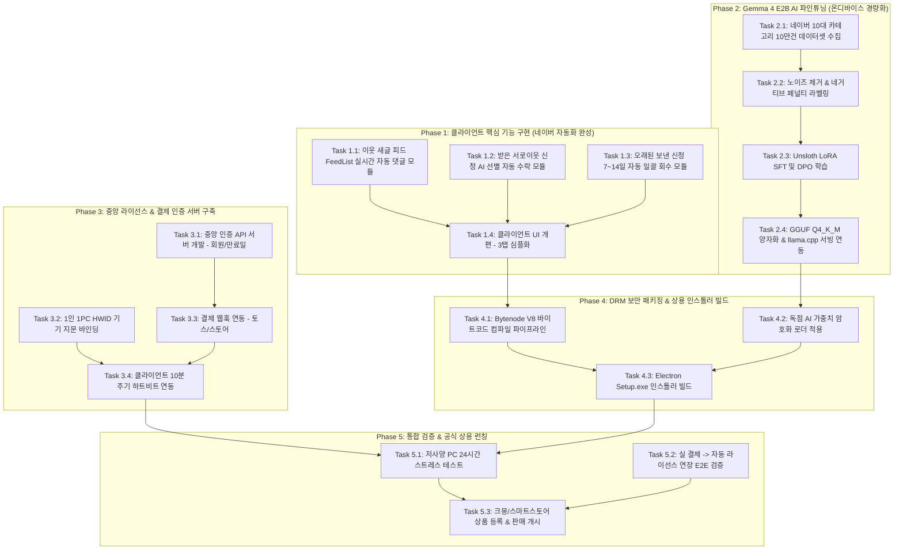

# 📋 [통합 실행 계획서] 상용 AI 블로그 솔루션 전체 업무 Task & 실행 로드맵

> **문서 코드**: TASK-MASTER-PLAN  
> **기반 문서**: [00_OVERVIEW.md](file:///D:/work/dev/blog/docs/00_OVERVIEW.md) ~ [05_KMONG_95782_COMPETITOR_ANALYSIS.md](file:///D:/work/dev/blog/docs/05_KMONG_95782_COMPETITOR_ANALYSIS.md)  
> **제품 원칙**: **100% 비공개 독점 상용 소프트웨어** + **월 구독제(9,900~14,900원)** + **Gemma 4 E2B 온디바이스 AI** + **1-Click AI 전자동화**  
> **최종 수정일**: 2026년 9월 6일

---

## 1. 전체 업무 프로세스 흐름도 (Execution Flow)

개발과 출시의 성공률을 극대화하기 위해 **[클라이언트 핵심 기능] → [AI 모델 파인튜닝] → [중앙 인증/결제 서버] → [DRM 보안 패키징] → [통합 검증 및 런칭]**의 5단계 순차 파이프라인으로 진행합니다.

---

## 2. 세부 업무 명세 (Phase별 상세 Task)

---

### 🚀 Phase 1: 클라이언트 핵심 기능 구현 & UI 개편
> **목표**: 상용 프로그램의 최고 핵심 무기인 '새글 피드 자동 댓글', '받은 신청 AI 수락', '보낸 신청 회수'를 기존 `apps/engagement`에 구현하고 복잡한 UI를 1클릭 중심 심플 UI로 개편.

#### [Task 1.1] 이웃 새글 피드(`FeedList.naver`) 실시간 자동 댓글 모듈 개발
* **선행 조건**: 기존 `lib/naver.js` 브라우저 세션
* **수행 내용**:
  1. 모바일 이웃 새글 피드(`https://m.blog.naver.com/FeedList.naver`) 파싱 함수 신설.
  2. 최신 20개 피드 항목에서 `logNo`, `blogId`, `title`, `snippet` 추출.
  3. 로컬 기록(`feed-history.json`)과 대조하여 이미 댓글을 작성한 글은 스킵(중복 방지).
  4. 본문 요약을 LLM에 전달하여 2~3줄 맞춤형 감상 댓글 생성.
  5. 포스팅 방문 → 공감(❤️) 클릭 → 댓글 작성 및 등록.
  6. 사람 행동 모사를 위한 60~120초 랜덤 지터 딜레이 및 10회 주기 10분 휴식 적용.
* **대상 파일**: `apps/engagement/lib/naver-feed-engage.js` (신규), `apps/engagement/server.js`
* **완료 기준(DoD)**: 새글 피드를 순회하며 실제 이웃의 새 글 5건에 대해 중복 없이 공감 및 문맥 댓글이 연속 정상 등록되는지 확인.

#### [Task 1.2] 받은 서로이웃 신청 AI 선별 자동 수락 모듈 개발
* **선행 조건**: 네이버 관리자 세션
* **수행 내용**:
  1. `https://admin.blog.naver.com/BuddyReceiveManage.naver` 접속 및 대기 신청 목록 파싱.
  2. 1차 룰 필터링: "우리 서로이웃해요~", "서이추해요" 등 기본 매크로 멘트 및 상업 키워드(대출, 보험, 분양, 도박) 즉시 거절(`reject`).
  3. 2차 AI 검증: 신청자 블로그 제목과 소개글을 AI가 분석하여 정상 활동 블로거 판정 시 자동 수락(`accept`).
  4. 처리 통계(수락 N건, 광고 거절 N건) 로그 기록.
* **대상 파일**: `apps/engagement/lib/naver-neighbor-cleaner.js` (신규)
* **완료 기준(DoD)**: 광고성 멘트 신청은 자동 거절되고, 일반 블로거 신청만 선별 수락되는 동작 테스트 완료.

#### [Task 1.3] 오래된 보낸 신청(7~14일 미수락) 자동 일괄 회수 모듈 개발
* **선행 조건**: 네이버 관리자 세션
* **수행 내용**:
  1. `https://admin.blog.naver.com/BuddyReceiveManage.naver?blogId={id}&type=send` 접속.
  2. 신청일 기준 설정값(기본 7일 또는 14일) 이상 경과한 미수락 대기 신청 목록 추출.
  3. 네이버 취소 API(`cancelBuddy.naver`)를 2~3초 간격으로 순차 호출하여 일괄 취소.
  4. 네이버 보낸 신청 500건 한도 슬롯 복구 및 회수 결과 리포트 출력.
* **대상 파일**: `apps/engagement/lib/naver-neighbor-cleaner.js`
* **완료 기준(DoD)**: 7일 이상 경과한 보낸 신청 10건이 정상적으로 일괄 취소되어 대기 목록에서 제거됨을 확인.

#### [Task 1.4] 클라이언트 UI/UX 개편 (3대 핵심 탭 심플화)
* **선행 조건**: Task 1.1 ~ 1.3 완료
* **수행 내용**:
  1. 기존의 수십 개 버튼/입력창을 모두 정리하고 **3대 핵심 탭**으로 개편:
     * **탭 1: 🤖 1-Click AI 전자동 (신규 이웃 발굴 & 답방)**
     * **탭 2: 📰 이웃 새글 피드 소통 (새글 실시간 공감+댓글)**
     * **탭 3: 🤝 스마트 이웃 관리 (받은 신청 AI 수락 + 보낸 신청 일괄 회수 + 유령이웃 정리)**
  2. 상단 헤더에 라이선스 만료 디데이(`[구독: D-28일 남음]`) 표시 영역 배치.
* **대상 파일**: `apps/engagement/public/index.html`, `apps/engagement/public/app.js`
* **완료 기준(DoD)**: 초보자도 설명서 없이 1클릭으로 모든 작업을 수행할 수 있는 직관적인 UI 완성.

---

### 🧠 Phase 2: Gemma 4 E2B AI 파인튜닝 & 온디바이스 패키징
> **목표**: 일반 PC(VRAM 2GB 미만, 내장 그래픽)에서도 0.5초 만에 한국어 찐이웃 감동 댓글을 생성하는 독점 경량 AI 완성 (외부 API 비용 0원 달성).

#### [Task 2.1] 네이버 10대 카테고리 본문-댓글 10만 건 데이터셋 수집
* **수행 내용**:
  1. 네이버 인기 블로그 10대 카테고리(맛집, 육아, 뷰티, IT, 여행 등) 대상 크롤러 작성.
  2. 각 포스팅 본문의 핵심 요약과 실제로 달린 반응 좋은 댓글 페어 수집.
  3. JSONL 포맷(`{ "category": "...", "post_summary": "...", "comment": "..." }`)으로 정제.
* **대상 파일**: `scripts/dataset_collector.py` (신규)
* **완료 기준(DoD)**: 노이즈 없는 고품질 100,000건 데이터셋 구축 완료.

#### [Task 2.2] 노이즈 정제 및 네거티브/포지티브 라벨링
* **수행 내용**:
  1. 로봇 매크로성 문구("좋은 포스팅 잘 보고 갑니다", "서이추 신청해요", "공감 꾹") 자동 필터링 및 DPO reject 데이터로 분류.
  2. 본문 고유명사(가게 이름, 제품명, 감정)를 짚어주는 2~3줄 감상 댓글을 DPO chosen 데이터로 라벨링.
* **완료 기준(DoD)**: SFT 훈련용 8만 건 + DPO 선호도 평가용 2만 쌍 데이터셋 준비 완료.

#### [Task 2.3] Unsloth LoRA SFT 및 DPO 파인튜닝 실행
* **수행 내용**:
  1. Google Gemma 4 E2B 베이스 모델 로드.
  2. LoRA(r=16, alpha=32) 파라미터 적용 후 SFT 3 에포크 학습.
  3. DPO 훈련을 통해 매크로 댓글 억제 및 본문 밀착형 감상 댓글 생성 가중치 극대화.
* **완료 기준(DoD)**: 평가 셋 기준 매크로 문구 발생률 0%, 본문 키워드 반영률 95% 이상 달성.

#### [Task 2.4] GGUF Q4_K_M 양자화 및 온디바이스 서빙 연동
* **수행 내용**:
  1. 파인튜닝된 가중치를 베이스에 병합 후 `llama.cpp` 양자화 스크립트로 Q4_K_M 변환 (용량 약 1.3GB).
  2. `apps/engagement/lib/embedded-llama.js`에 신규 모델 등록 및 자동 로드 설정.
  3. 일반 CPU/GPU 환경에서 추론 속도 측정 (목표: 0.5초 이내).
* **완료 기준(DoD)**: 인터넷 연결 없이도 로컬에서 0.5초 만에 자연스러운 댓글이 생성되는 것 확인.

---

### 🔐 Phase 3: 중앙 인증 & 라이선스 결제 서버 구축
> **목표**: 결제한 유료 회원만 프로그램을 쓸 수 있도록 1인 1PC 하드웨어 바인딩(HWID)과 결제 자동 연동 인프라 구축.

#### [Task 3.1] 중앙 인증 API 서버 개발 (Auth Server)
* **수행 내용**:
  1. 경량 클라우드 API 서버 구축 (Node.js Express + SQLite/Supabase).
  2. 엔드포인트 구현:
     * `POST /api/auth/register` (회원가입)
     * `POST /api/auth/login` (로그인 및 JWT 발급)
     * `POST /api/license/verify` (라이선스 유효성 및 HWID 검증)
     * `POST /api/license/heartbeat` (10분 주기 세션 생존 신고)
* **대상 파일**: `apps/license-server/` (신규 서버 프로젝트)
* **완료 기준(DoD)**: 사용자 등록, 로그인, 만료일 검증 API가 정상 동작하고 JWT 서명 토큰이 정상 발행됨.

#### [Task 3.2] 1인 1PC HWID(하드웨어 지문) 바인딩 및 중복 차단
* **수행 내용**:
  1. 클라이언트에서 메인보드 UUID + CPU 모델 + MAC 주소를 조합해 단방향 SHA-256 해시값 생성.
  2. 최초 로그인 시 서버 DB에 `hwid` 바인딩.
  3. 다른 PC에서 로그인 시도시 기기 불일치 오류(`UNAUTHORIZED_DEVICE`) 반환 및 실행 차단.
* **대상 파일**: `apps/engagement/lib/hwid.js` (신규)
* **완료 기준(DoD)**: PC A에서 활성화된 계정으로 PC B에서 접속 시 즉각 차단됨을 검증.

#### [Task 3.3] 결제 연동 웹훅(Webhook) 및 만료일 자동 갱신
* **수행 내용**:
  1. 토스페이먼츠 정기결제 웹훅 수신 엔드포인트 구현 (`POST /api/webhook/toss`).
  2. 크몽 / 스마트스토어 주문번호 확인 API 구현.
  3. 결제 성공 이벤트 수신 시 대상 계정의 `expires_at`을 `+30일` 자동 연장.
* **완료 기준(DoD)**: 테스트 결제 호출 시 DB의 만료일자가 즉시 30일 뒤로 갱신되고 클라이언트에 반영됨.

#### [Task 3.4] 클라이언트 라이선스 인증 화면 & 하트비트 연동
* **수행 내용**:
  1. 클라이언트 실행 시 첫 화면으로 [로그인 / 라이선스키 입력 모달] 표출.
  2. 미결제/만료 시 결제 페이지 이동 버튼과 함께 프로그램 전체 메뉴 비활성화.
  3. 10분 주기 하트비트 통신 및 24시간 오프라인 유예 모드(네트워크 끊김 대비) 적용.
* **완료 기준(DoD)**: 구독 만료 계정으로 접속 시 기능이 잠기고, 결제 후 즉시 잠금 해제되는 전체 사이클 검증.

---

### 🛡️ Phase 4: DRM 보안 패키징 & 상용 인스톨러 빌드
> **목표**: 소스코드 비공개 난독화(Bytenode V8 컴파일)와 인스톨러(.exe) 제작으로 크랙 방지 및 배포 준비.

#### [Task 4.1] Bytenode V8 바이트코드 컴파일 파이프라인 구축
* **수행 내용**:
  1. `bytenode` 패키지를 빌드 파이프라인에 통합.
  2. 핵심 소스코드(`naver.js`, `automation.js`, `llm.js` 등)를 텍스트 .js가 아닌 바이너리 바이트코드(`.jsc`)로 컴파일.
  3. 일반 텍스트 편집기나 디컴파일러로 코드를 열어볼 수 없도록 100% 원천 차단.
* **완료 기준(DoD)**: `.jsc` 파일만으로 Electron 앱이 정상 구동되며 소스코드가 노출되지 않음.

#### [Task 4.2] 독점 AI 가중치 헤더 암호화 로더
* **수행 내용**:
  1. Gemma 4 E2B GGUF 파일 헤더에 256비트 AES 암호화 키 적용.
  2. 인증된 정품 클라이언트 구동 시에만 메모리 상에서 복호화하여 llama-server로 전달.
* **완료 기준(DoD)**: 모델 파일만 단독으로 외부에서 복사해 사용할 수 없도록 보호 조치 완료.

#### [Task 4.3] Electron 인스톨러(Setup.exe) 자동 빌드
* **수행 내용**:
  1. `electron-builder` 설정: NSIS 윈도우 단일 설치 파일(`이웃메이트_Setup.exe`) 생성.
  2. 바탕화면 바로가기 아이콘, 자동 업데이트(Auto-Updater) 모듈 구성.
* **완료 기준(DoD)**: 클릭 한 번으로 설치되고 바탕화면에 아이콘이 생성되는 깔끔한 인스톨러 생성.

---

### 🎯 Phase 5: 통합 검증 & 공식 상용 런칭
> **목표**: 실제 저사양 PC 안정성 검증, 결제 프로세스 실전 테스트 후 크몽 및 스마트스토어 판매 개시.

#### [Task 5.1] 일반 보급형 저사양 PC 24시간 스트레스 테스트
* **수행 내용**:
  1. 외장 그래픽이 없는 일반 사무용 인텔 내장 그래픽 노트북(RAM 8GB)에서 프로그램 설치.
  2. 이웃 새글 자동 댓글 100건, 받은 신청 수락, AI 전자동 소통을 24시간 동안 연속 구동.
  3. 메모리 누수, 크래시, 네이버 세션 끊김 여부 모니터링.
* **완료 기준(DoD)**: 24시간 구동 중 에러 없이 안정적으로 100건 소통 및 새글 댓글 작성 완료.

#### [Task 5.2] 실 결제 → 자동 라이선스 연장 E2E 테스트
* **수행 내용**:
  1. 실제 9,900원 결제 진행 → 웹훅 수신 → 만료일 +30일 연장 → 클라이언트 잠금 해제 전 과정 검증.
  2. 만료일 도래 시 자동 차단 및 재결제 안내 팝업 검증.
* **완료 기준(DoD)**: 결제부터 프로그램 사용까지 무인(Zero-Touch)으로 100% 자동 처리됨 확인.

#### [Task 5.3] 판매 상세페이지 제작 및 공식 판매 개시
* **수행 내용**:
  1. **크몽(Kmong) 등록**: '블로그 이웃 관리 솔루션' 카테고리에 월 9,900원 특가로 등록 (경쟁사 25,000원 대비 파격가).
  2. **네이버 스마트스토어 등록**: 주문 시 구매자 이메일로 라이선스키 자동 발송 시스템 연동.
  3. 초보자용 3분 설치 및 사용 가이드 영상/PDF 매뉴얼 제작 배포.
* **완료 기준(DoD)**: 크몽 및 스마트스토어 상품 승인 완료 및 정식 판매 개시.

---

## 3. 마일스톤 일정표 (Timeline & Dependencies)

| 주차 | 주요 목표 | 담당 Task | 핵심 결과물 |
| :---: | :--- | :--- | :--- |
| **1주차** | **클라이언트 핵심 기능 완성** | Task 1.1 ~ 1.4 | 새글 피드 자동 댓글 + 받은신청 수락 + 보낸신청 회수 + 3탭 심플 UI |
| **2주차** | **Gemma 4 E2B AI 파인튜닝** | Task 2.1 ~ 2.4 | 10만건 데이터셋 학습 + Q4 양자화 모델(1.3GB) + 0.5초 로컬 추론 |
| **3주차** | **중앙 라이선스 & 결제 서버** | Task 3.1 ~ 3.4 | 1인 1PC HWID 바인딩 + 결제 웹훅 연동 + 만료일 자동 관리 |
| **4주차** | **보안 패키징 & 공식 출시** | Task 4.1 ~ 5.3 | Bytenode V8 컴파일 + Setup.exe 빌드 + 저사양 PC 검증 + 크몽 판매 개시 |

---

## 4. 즉시 착수 우선순위 (Immediate Next Actions)

지금 당장 착수해야 할 작업 순서는 다음과 같습니다:

1. **[Step 1] Phase 1 클라이언트 기능 구현**:
   * `apps/engagement/lib/naver-feed-engage.js` 생성하여 모바일 이웃 피드(`FeedList.naver`) 파싱 및 자동 댓글 로직 작성.
2. **[Step 2] Phase 1 이웃 수락 및 회수 기능 구현**:
   * `apps/engagement/lib/naver-neighbor-cleaner.js` 생성하여 받은 신청 자동 수락 및 오래된 보낸 신청 회수 로직 작성.
3. **[Step 3] UI 3탭 심플화 적용**:
   * 복잡한 세부 옵션을 숨기고 [1-Click AI 전자동], [이웃 새글 피드 소통], [스마트 이웃 관리] 3탭으로 메인 화면 단장.
