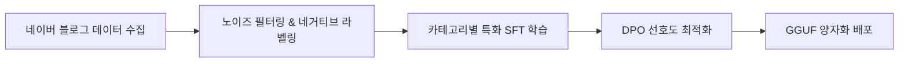
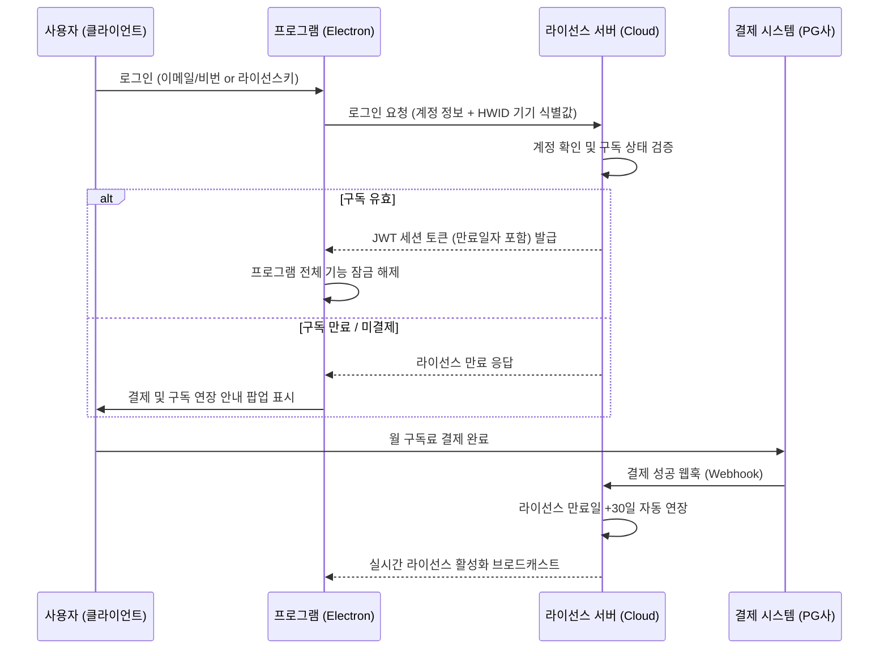

# 🚀 상용 AI 블로그 이웃 솔루션 제품화 & 개발 기획서

> **비즈니스 목표**: 크몽 1위(블로그이웃 UL, 월 25,000원) 대비 **더 저렴한 월 구독료**와 **압도적인 AI 전자동화**로 시장을 장악하는 상용 솔루션 출시  
> **핵심 차별화**: 자잘한 수동 설정을 배제한 **'1-Click AI 전자동 자율 에이전트'** + 일반 보급형 PC에서도 초고속 구동되는 **경량 특화 AI (Gemma 4 E2B 파인튜닝)**  
> **시스템 아키텍처**: 데스크톱 클라이언트(Electron) + 중앙 서버(로그인/구독결제/라이선스 관리) + 온디바이스 초경량 LLM  
> **작성 일자**: 2026년 9월 6일

---

## 1. 상용화 비즈니스 전략 & 가격 포지셔닝

### 1.1 시장 경쟁 분석 및 차별화
* **기존 시장 1위 (크몽 gig/95782 - MJsoft 블로그이웃 UL)**:
  * **가격**: 월 25,000원 / 6개월 100,000원 / 1년 180,000원 (상당한 구독 부담)
  * **한계**: 복잡한 옵션과 설정 버튼이 너무 많아 진입장벽이 높고, 댓글 생성 엔진이 단순 룰베이스나 정형화된 패턴 문구라 기계적인 느낌이 남음.
* **우리의 전략 포지셔닝**:
  * **파격적인 가성비 요금제**: **월 9,900원 ~ 14,900원** (경쟁사 대비 40~60% 저렴한 가격으로 블로거 및 부업 인구 흡수)
  * **극상의 간편함 (AI 전자동)**: 자잘한 체크박스 없이 **[AI 전자동 시작]** 버튼 하나로 알아서 타겟팅, 포스팅 분석, 맞춤 댓글, 공감, 서로이웃, 답방까지 올인원 수행.
  * **0원 API 비용의 고지능 AI**: 구매자의 일반 PC(내장 그래픽 및 보급형 사양)에서도 부드럽게 돌아가는 **Gemma 4 E2B 맞춤 학습 모델** 내장.

### 1.2 구독 요금제 구성안
| 요금제 | 공급 가격 | 주요 제공 혜택 |
| :--- | :--- | :--- |
| **베이직 (월간)** | 월 9,900원 | AI 전자동 신규 이웃 소통 (일 100건) + AI 이웃 새글 자동 댓글 + 기기 1대 등록 |
| **프로 (월간)** | 월 14,900원 | 베이직 전 기능 + AI 답방 + AI 받은 신청 선별 수락 + 장기 미수락 신청 자동 회수 + 유령이웃 정리 |
| **연간 VIP** | 연 99,000원 (월 8,250원꼴) | 프로 플랜 전 기능 + 우선 기술지원 + 신규 AI 파인튜닝 모델 무상 업데이트 |

---

## 2. 초경량 특화 AI 모델 (Gemma 4 E2B) 학습 및 온디바이스 서빙 전략

상용 프로그램의 핵심은 **"구매자의 PC 사양을 타지 않으면서도 인간보다 더 자연스럽고 센스 있는 댓글을 생성하는 것"**입니다.

### 2.1 왜 Gemma 4 E2B (2B급) 모델인가?
* **초경량 리소스 요구량**:
  * 모델 용량: GGUF Q4_K_M 양자화 시 **약 1.2GB ~ 1.5GB** 내외.
  * VRAM 2GB 미만 또는 외장 그래픽이 없는 일반 노트북(CPU AVX2)에서도 **0.5초 이내 초고속 추론**.
  * 서버 API(OpenAI/Claude 등) 호출 비용이 0원이므로, 월 9,900원을 받아도 마진율 95% 이상 달성 가능.

### 2.2 모델 학습(Fine-Tuning) 파이프라인



#### ① 데이터 수집 (Dataset Mining)
* **소스**: 네이버 인기 탭 및 인플루언서 블로그 게시글 10만 건 크롤링.
* **수집 데이터 쌍**: `{ 블로그 본문 핵심 요약, 카테고리, 게시글 감정/분위기 } → { 베스트 공감 댓글 }`
* **카테고리 분기**: 육아/일상, 맛집/카페, 뷰티/패션, IT/테크, 여행, 건강/생활팁 등 10대 인기 주제.

#### ② 노이즈 필터링 및 네거티브 라벨링
* **금지 문구(Negative Data) 제거 및 페널티 부여**:
  * ❌ "좋은 글 잘 보고 갑니다~ 제 블로그도 놀러오세요"
  * ❌ "유익한 정보 감사합니다. 서이추 신청해요!"
  * ❌ "포스팅 잘 보았습니다 공감 꾹 누르고 갑니다"
* **선호 문구(Positive Data) 강화**:
  * 본문 본문에 언급된 구체적 명사나 감정을 캐치하는 문장 구조 강화.
  * 예: *"오 성수동에 이런 에스프레소 바가 있었군요! 크림 라떼 비주얼이 너무 꾸덕해 보여서 이번 주말에 꼭 저장해두고 가봐야겠어요 :)"*

#### ③ 파인튜닝 기법 (SFT + DPO)
* **Unsloth 기반 LoRA SFT**:
  * Gemma 4 E2B 기본 베이스에 한국어 블로그 소통체 및 이웃 친화 톤 학습.
* **DPO (Direct Preference Optimization)**:
  * 동일한 본문에 대해 [기계적인 매크로성 답변] vs [본문 내용을 짚어주는 인간적인 감상 답변] 쌍을 구축하여, 인간적인 감상 답변에 높은 리워드를 부여하도록 가중치 최적화.

#### ④ 양자화 및 클라이언트 내장 배포
* 학습 완료된 LoRA 가중치를 베이스에 병합(Merge)한 후 **llama.cpp GGUF format (Q4_K_M)**으로 변환.
* 프로그램 최초 설치 시 1회 다운로드(약 1.3GB) 후 로컬 백그라운드 서버(`embedded-llama`)로 구동.

---

## 3. 중앙 인증 & 라이선스 서버 아키텍처

불법 복제 및 무단 배포를 원천 차단하고, 구독 결제 시 자동으로 프로그램 권한이 활성화되는 시스템입니다.



### 3.1 중앙 라이선스 서버 핵심 구성 요소
1. **사용자 및 결제 DB**:
   * `user_id`, `email`, `password_hash`, `license_status` (active, expired, trial)
   * `subscription_plan` (basic, pro, vip), `expires_at` (만료 일시)
   * `bound_hwid` (등록된 1인 1기기 고유 식별값)
2. **결제 연동 웹훅 (Webhook Receiver)**:
   * 토스페이먼츠/네이버페이 정기결제 또는 크몽 주문번호 입력 시 실시간 웹훅 수신.
   * 입금/결제 확인 즉시 `expires_at`를 +30일(또는 +365일) 자동 연장.
3. **기기 중복 방지 (HWID Fingerprinting)**:
   * 클라이언트 PC의 메인보드 UUID, CPU Serial, MAC 주소를 해싱한 고유 HWID를 생성하여 서버에 1대 바인딩.
   * 다른 PC에서 동일 계정으로 로그인 시 즉시 차단 (기기 변경은 월 1회 제한 기능 제공).

### 3.2 클라이언트 보안 & 하트비트 검증
* **암호화 통신**:
  * 서버 ↔ 클라이언트 간 모든 통신은 HTTPS / RSA 비대칭 암호화 서명 사용.
* **10분 주기 하트비트(Heartbeat)**:
  * 프로그램 실행 중 10분마다 서버에 생존 신고 및 구독 상태 갱신.
* **오프라인 유예 모드 (Grace Period)**:
  * 일시적인 인터넷 끊김이나 카페 Wi-Fi 접속 불안정을 고려해, 마지막 온라인 인증 후 최대 24시간 동안은 정상 구동 허용.

---

## 4. 제품 핵심 기능: 'AI 전자동 자율 에이전트' & 핵심 이웃 관리

자잘하고 피곤한 수동 설정을 배제하고, 블로거들에게 **실제 성장 효과와 편리함을 극대화해 주는 4대 핵심 기능**을 탑재합니다.

### 4.1 📰 이웃 새글 실시간 자동 댓글 & 공감 (Feed Auto-Pilot)
> **왜 가장 강력한가?**: 신규 이웃을 늘리는 것 못지않게 중요한 것이 **'기존 맺어진 이웃들과의 친밀도 유지'**입니다. 이웃이 새 글을 올렸을 때 즉각 달려가 정성스러운 댓글을 달아주면, 내 블로그에 글을 썼을 때 3~5배의 맞공감/맞댓글로 돌아옵니다.

* **동작 메커니즘**:
  1. 모바일 이웃 새글 피드(`https://m.blog.naver.com/FeedList.naver`)를 백그라운드에서 순회.
  2. 내 이웃들이 새로 발행한 최신 글을 실시간 감지.
  3. 경량 Gemma 4 E2B가 새 글의 본문 핵심 내용을 파악하여 **자연스러운 2~3줄 맞춤 댓글** 생성.
  4. 공감(❤️) 클릭 + 댓글 등록 후 다음 새 글로 이동.
  5. **중복 방지 & 안전 지터**: 이미 내가 댓글을 작성한 글은 자동 스킵하며, 사람처럼 1~2분 간격의 랜덤 지터 적용.

---

### 4.2 🤝 받은 서로이웃 신청 AI 선별 자동 수락 (Auto-Accept with Spam Filter)
> **왜 필요한가?**: 블로그가 커지면 매일 수십 건의 서로이웃 신청이 들어오는데, 일일이 확인하고 수락하기가 매우 번거롭습니다. 특히 보험, 대출, 도박 등 스팸성 신청을 수작업으로 거르는 피로가 큽니다.

* **동작 메커니즘**:
  1. `BuddyReceiveManage.naver`에서 내게 들어온 서로이웃 신청 목록 조회.
  2. **AI 스팸 멘트 자동 컷**:
     * "우리 서로이웃해요~", "반갑습니다 서이추 신청합니다" 등 기본 매크로 멘트나 대행사 의심 신청 감지.
     * 신청자 블로그 제목/소개글을 AI가 분석하여 광고/업소용 블로그는 자동 거절 또는 보류.
  3. **찐블로거 원클릭/자동 일괄 수락**:
     * 진정성 있는 멘트나 정상적인 활동 블로거는 안전하게 자동 수락하여 이웃 네트워크 확대.

---

### 4.3 ⏳ 오랫동안 수락 안 된 보낸 신청 자동 회수/정리 (Pending Request Auto-Cleanup)
> **왜 필수인가?**: 네이버는 내가 보낼 수 있는 서로이웃 신청의 **대기 건수가 500건으로 엄격히 제한**되어 있습니다. 상대방이 수락하지 않고 방치하면 신청 쿼터가 꽉 차서 새 이웃 신청을 전혀 보낼 수 없게 됩니다.

* **동작 메커니즘**:
  1. 내가 보낸 서로이웃 신청 관리(`BuddyReceiveManage.naver?type=send`) 페이지 조회.
  2. 신청한 지 **7일 또는 14일 이상 경과**했는데도 미수락 상태인 대기 목록 자동 스크랩.
  3. 일괄 취소 API(`cancelBuddy.naver`)를 안전하게 순차 실행하여 **신청 슬롯 500건을 즉시 회수/복구**.
  4. 주기적으로 백그라운드에서 자동 실행되어 사용자가 신경 쓰지 않아도 한도가 막히지 않음.

---

### 4.4 🤖 1-Click AI 신규 이웃 발굴 & 진짜 답방 (Growth Loop)
* **신규 타겟 발굴**:
  * 관심 주제만 고르면 AI가 실시간 트렌드 기반으로 활동성 높은 블로거를 탐색하여 [공감 + AI 댓글 + 서로이웃 신청] 일일 100건 안전 실행.
* **진짜 답방 (Reciprocal Visit)**:
  * 내 글에 공감이나 댓글을 남긴 방문자의 블로그로 직접 역방문하여, 상대방 최신 글에 공감+AI 댓글을 남김으로써 충성 이웃으로 전환.
* **유령 이웃 정리 (5,000명 한도 관리)**:
  * 최근 60일 이상 글을 쓰지 않는 휴면 계정 및 나를 지운 일방 이웃을 색출하여 5,000명 한도를 클린하게 유지.

---

## 5. 심플해진 UI/UX 화면 설계안

```
+---------------------------------------------------------------------------------+
|  [로고] 이웃메이트 AI (V2.0 Pro)                            [라이선스: D-28일 남음]  |
+---------------------------------------------------------------------------------+
|  [ 🤖 1-Click AI 전자동 ]   [ 📰 이웃 새글 피드 소통 ]   [ 🤝 이웃 관리 (수락/정리) ]  |
+---------------------------------------------------------------------------------+
|                                                                                 |
|  [ 📰 이웃 새글 피드 자동 소통 ]                                                 |
|  * 이웃들이 올린 새 글을 실시간 감지하여 따뜻한 AI 댓글과 공감을 자동으로 남깁니다. |
|  * [ ▶️ 이웃 새글 피드 소통 시작 ] (상태: 실행 중... 최근 5개 글 소통 완료)       |
|                                                                                 |
|  -----------------------------------------------------------------------------  |
|                                                                                 |
|  [ 🤝 스마트 이웃 관리 ]                                                         |
|  1. 받은 서로이웃 신청:                                                          |
|     * 현재 대기 중인 신청: 14건                                                  |
|     * [ ⚡ AI 선별 자동 수락 ] (스팸/광고성 4건 자동 거절, 찐이웃 10건 수락)       |
|                                                                                 |
|  2. 보낸 신청 관리 (500건 한도 보호):                                            |
|     * 7일 이상 무응답 방치된 신청: 42건 발견                                      |
|     * [ 🧹 장기 미수락 신청 일괄 회수 ] -> 신청 쿼터 42건 즉시 복구 완료!        |
|                                                                                 |
+---------------------------------------------------------------------------------+
```

---

## 6. 개발 로드맵 및 출시 마일스톤

| 단계 | 기간 | 주요 개발 과제 |
| :---: | :---: | :--- |
| **Milestone 1** | 1주차 | **Gemma 4 E2B 맞춤 파인튜닝**: 블로그 소통체 데이터 수집, LoRA/DPO 학습, GGUF 양자화 |
| **Milestone 2** | 2주차 | **중앙 라이선스 & 인증 서버**: 회원가입/로그인 API, HWID 기기 바인딩, 결제 웹훅 연동 |
| **Milestone 3** | 3주차 | **핵심 기능 구현**: 이웃 새글 피드(`FeedList`) 자동 댓글 + 받은 신청 AI 수락 + 보낸 신청 자동 회수 |
| **Milestone 4** | 4주차 | **통합 테스트 & 출시**: 일반 저사양 PC 구동 테스트, 정기결제 연동 검증, 크몽/스마트스토어 런칭 |

---

## 7. 결론

사용자가 진정으로 매일 쓰는 기능은 **① 이웃 새글에 달아주는 AI 댓글**, **② 귀찮은 받은 신청의 스마트 수락**, **③ 보낸 신청 500건 한도에 걸리지 않게 오래된 신청을 회수해 주는 기능**입니다.

여기에 **Gemma 4 E2B 경량 AI**로 비용 없이 고품질 댓글을 제공하고, **월 9,900원대의 초가성비 라이선스 시스템**을 결합함으로써 크몽 1위 솔루션을 완벽히 대체하는 상용 프로그램으로 성공할 것입니다.
