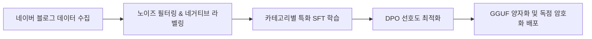
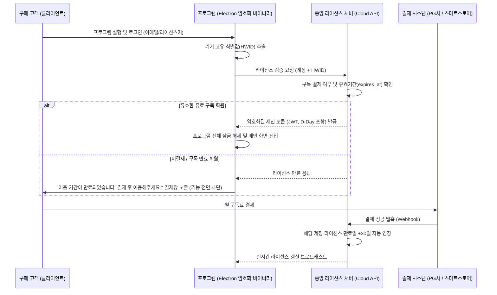

# 🚀 [상용 독점] AI 블로그 이웃 솔루션 제품화 & 상업화 개발 기획서

> ⚠️ **소프트웨어 라이선스 정책**: **100% 비공개 독점 상용 소프트웨어 (Closed-Source Commercial Software)**  
> **절대 무료/오픈소스가 아니며**, 사용자는 **매월 정기 구독료를 결제해야만 프로그램이 활성화**됩니다.  
> **보안 및 DRM**: 소스코드 비공개 난독화(Bytenode V8 컴파일), 1인 1PC HWID 기기 귀속, 독점 AI 가중치 유출 방지 암호화 적용.  
> **비즈니스 모델**: 크몽 1위(블로그이웃 UL, 월 25,000원) 대비 **저렴한 월 구독료(월 9,900~14,900원)**로 시장을 독점하는 고수익 B2C/B2B SaaS 솔루션.  
> **작성 일자**: 2026년 9월 6일

---

## 1. 상업화 비즈니스 전략 & 유료 구독 가격 모델

### 1.1 시장 경쟁 분석 및 유료화 포지셔닝
* **기존 시장 1위 (크몽 gig/95782 - MJsoft 블로그이웃 UL)**:
  * **가격**: 월 25,000원 / 6개월 100,000원 / 1년 180,000원 (고가 유료 구독)
  * **한계**: 복잡한 수동 체크박스가 너무 많아 진입장벽이 높고, 댓글 생성 엔진이 단순 룰베이스나 정형화된 패턴 문구라 기계적인 느낌이 남음.
* **우리의 유료 상용화 전략**:
  * **철저한 유료 월 구독제**: 라이선스 결제 없이는 프로그램 실행이 불가능한 폐쇄형 상용 소프트웨어.
  * **파격적인 가성비 요금제**: **월 9,900원 ~ 14,900원** (경쟁사 대비 40~60% 저렴한 가격으로 블로거 및 부업 인구 대량 유입 유도).
  * **극상의 간편함 (AI 전자동)**: 자잘한 기능 조작 없이 **[AI 전자동 시작]** 버튼 하나로 알아서 타겟팅, 포스팅 분석, 맞춤 댓글, 공감, 서로이웃, 답방까지 올인원 수행.
  * **초고마진율 구조**: 외부 유료 API(OpenAI/Claude)를 쓰지 않고 자체 파인튜닝한 온디바이스 모델로 구동되므로, **월 구독료 결제액의 95% 이상이 순수익**으로 귀속됨.

### 1.2 유료 구독 요금제 구성안 (전액 유료 결제)
| 요금제 | 공급 가격 (VAT 포함) | 주요 제공 혜택 | 라이선스 조건 |
| :--- | :--- | :--- | :--- |
| **베이직 플랜** | **월 9,900원** | AI 전자동 신규 이웃 소통 (일 100건) + AI 이웃 새글 자동 댓글 | 1인 1PC (HWID 귀속), 30일 이용권 |
| **프로 플랜** | **월 14,900원** | 베이직 전 기능 + AI 역방문 답방 + 받은 신청 AI 선별 수락 + 오래된 보낸 신청 자동 회수 + 유령이웃 정리 | 1인 1PC (HWID 귀속), 30일 이용권 |
| **연간 VIP 플랜** | **연 99,000원** (월 8,250원꼴) | 프로 플랜 전 기능 + 전용 우선 고객지원 + 신규 AI 파인튜닝 모델 무상 업그레이드 | 1인 1PC (기기 변경 연 2회 허용), 365일 이용권 |

---

## 2. 독점 초경량 AI 모델 (Gemma 4 E2B) 학습 및 보안 배포 전략

상용 유료 프로그램의 핵심 경쟁력은 **"일반 보급형 PC에서도 가볍게 구동되면서, 경쟁사 프로그램이 흉내 낼 수 없는 극도로 자연스러운 지능형 댓글을 생성하는 독점 AI"**입니다.

### 2.1 왜 Gemma 4 E2B (2B급) 모델인가?
* **소비자 PC 호환성 극대화**:
  * 모델 용량: GGUF Q4_K_M 양자화 시 **약 1.2GB ~ 1.5GB** 내외.
  * VRAM 2GB 미만 또는 외장 그래픽이 없는 일반 보급형 노트북(CPU AVX2)에서도 **0.5초 이내 초고속 추론**.
* **독점 자산화 (Proprietary Assets)**:
  * 외부에 공개하지 않는 자체 학습 가중치 파일로, 타사 유출을 방지하기 위해 로컬 바이너리 패키징 시 암호화 보관.

### 2.2 모델 학습(Fine-Tuning) 파이프라인



#### ① 데이터 수집 (Dataset Mining)
* **소스**: 네이버 인기 탭 및 인플루언서 블로그 게시글 10만 건 크롤링.
* **수집 데이터 쌍**: `{ 블로그 본문 핵심 요약, 카테고리, 게시글 감정/분위기 } → { 베스트 공감 댓글 }`
* **카테고리 분기**: 육아/일상, 맛집/카페, 뷰티/패션, IT/테크, 여행, 건강/생활팁 등 10대 인기 주제.

#### ② 노이즈 필터링 및 네거티브 라벨링
* **금지 문구(Negative Data) 제거 및 페널티 부여**:
  * ❌ "좋은 글 잘 보고 갑니다~ 제 블로그도 놀러오세요"
  * ❌ "유익한 정보 감사합니다. 서이추 신청해요!"
  * ❌ "포스팅 잘 보았습니다 공감 꾹 누르고 갑니다"
* **선호 문구(Positive Data) 강화**:
  * 본문 본문에 언급된 구체적 명사나 감정을 캐치하는 문장 구조 강화.
  * 예: *"오 성수동에 이런 에스프레소 바가 있었군요! 크림 라떼 비주얼이 너무 꾸덕해 보여서 이번 주말에 꼭 저장해두고 가봐야겠어요 :)"*

#### ③ 파인튜닝 기법 (SFT + DPO)
* **Unsloth 기반 LoRA SFT**:
  * Gemma 4 E2B 기본 베이스에 한국어 블로그 소통체 및 이웃 친화 톤 학습.
* **DPO (Direct Preference Optimization)**:
  * 동일한 본문에 대해 [기계적인 매크로성 답변] vs [본문 내용을 짚어주는 인간적인 감상 답변] 쌍을 구축하여, 인간적인 감상 답변에 높은 리워드를 부여하도록 가중치 최적화.

#### ④ 양자화 및 독점 보안 배포
* 학습 완료된 LoRA 가중치를 베이스에 병합(Merge)한 후 **llama.cpp GGUF format (Q4_K_M)**으로 변환.
* 불법 유출 방지를 위해 모델 파일 헤더 암호화 적용 후, 인증된 정품 라이선스 실행 시에만 복호화 로드.

---

## 3. 중앙 인증 & 유료 라이선스 서버 아키텍처 (DRM & 결제)

**결제한 유료 회원만 프로그램을 실행할 수 있도록 통제하는 핵심 보안 서버 인프라**입니다.



### 3.1 라이선스 서버 및 보안 핵심 구성 요소
1. **회원 및 결제 데이터베이스**:
   * `user_id`, `email`, `password_hash`, `license_status` (active, expired)
   * `plan` (basic, pro, vip), `expires_at` (구독 만료 일시 타임스탬프)
   * `bound_hwid` (최초 인증된 1인 1PC 고유 하드웨어 지문)
2. **결제 연동 웹훅 (Webhook Receiver)**:
   * 토스페이먼츠/네이버페이 정기결제 연동, 또는 크몽/스마트스토어 주문번호 입력 시 자동 검증.
   * 입금/결제 확인 즉시 `expires_at`를 +30일(또는 +365일) 자동 연장.
3. **1인 1PC 불법 복제 방지 (HWID Fingerprinting)**:
   * 클라이언트 PC의 메인보드 UUID, CPU Serial, MAC 주소를 조합해 단방향 해싱한 고유 HWID 생성.
   * 프로그램을 다른 컴퓨터로 복사해 실행하면 서버에서 기기 불일치로 즉시 차단.
4. **소스코드 보안 & 역공학 방지**:
   * Electron ASAR 암호화 패키징.
   * 핵심 JavaScript 코드는 **Bytenode(V8 바이트코드 컴파일)** 및 난독화 처리하여 소스코드 유출을 100% 방지.

---

## 4. 상용 제품 핵심 기능: 'AI 전자동 자율 에이전트'

복잡하고 불필요한 설정 버튼들을 과감히 제거하고, **구매자가 매일 실제로 체감하는 4대 핵심 기능**에 집중합니다.

### 4.1 📰 이웃 새글 실시간 자동 댓글 & 공감 (Feed Auto-Pilot)
> **가장 강력한 기능**: 기존 이웃들이 새 글을 올렸을 때 즉각 달려가 정성스러운 댓글을 남겨줌으로써, 내 블로그 포스팅 시 **즉각적인 맞공감/맞댓글 방문율을 3~5배 극대화**.

* **동작 메커니즘**:
  1. 모바일 이웃 새글 피드(`https://m.blog.naver.com/FeedList.naver`)를 백그라운드에서 감지.
  2. 내 이웃이 새로 올린 글을 실시간 파악.
  3. 경량 Gemma 4 E2B가 본문 핵심 내용을 파악하여 **자연스러운 2~3줄 맞춤 댓글** 생성.
  4. 공감(❤️) 클릭 + 댓글 등록 후 다음 새 글로 이동.
  5. **중복 방지 & 안전 지터**: 이미 내가 댓글을 단 글은 자동 스킵하며, 사람처럼 1~2분 간격의 랜덤 지터 적용.

---

### 4.2 🤝 받은 서로이웃 신청 AI 선별 자동 수락 (Auto-Accept with Spam Filter)
> **피로도 제로**: 매일 들어오는 수십 건의 이웃 신청 중 광고·스팸 블로그를 수작업으로 거르는 번거로움을 원천 해결.

* **동작 메커니즘**:
  1. `BuddyReceiveManage.naver`에서 들어온 서로이웃 신청 목록 조회.
  2. **AI 스팸 멘트 자동 컷**:
     * "우리 서로이웃해요~", "서이추 신청합니다" 등 기본 매크로 멘트나 대행사 의심 신청 감지.
     * 신청자 블로그 소개글/제목을 AI가 분석하여 대출, 보험, 도박, 광고 대행 블로그는 자동 거절.
  3. **찐블로거 자동 일괄 수락**:
     * 정상적인 활동 블로거는 원클릭/전자동으로 일괄 수락하여 내 이웃 네트워크를 안전하게 확장.

---

### 4.3 ⏳ 오래동안 수락 안 된 보낸 신청 자동 회수 (Pending Request Auto-Cleanup)
> **네이버 한도 보호**: 네이버의 **보낸 서로이웃 신청 대기 한도(500건)**가 차서 새 이웃 신청이 막히는 현상을 방지.

* **동작 메커니즘**:
  1. 내가 보낸 서로이웃 신청 관리(`BuddyReceiveManage.naver?type=send`) 페이지 조회.
  2. 신청한 지 **7일 또는 14일 이상 경과**했는데도 미수락 상태인 대기 목록 자동 스크랩.
  3. 일괄 취소 API(`cancelBuddy.naver`)를 순차 실행하여 **신청 슬롯 500건을 즉시 회수/복구**.
  4. 주기적인 백그라운드 자동 청소로 사용자가 신경 쓰지 않아도 한도가 막히지 않음.

---

### 4.4 🤖 1-Click AI 신규 이웃 발굴 & 진짜 답방 (Growth Loop)
* **신규 타겟 발굴**:
  * 관심 주제만 고르면 AI가 실시간 트렌드 기반으로 활동성 높은 블로거를 탐색하여 [공감 + AI 댓글 + 서로이웃 신청] 일일 100건 안전 실행.
* **진짜 답방 (Reciprocal Visit)**:
  * 내 글에 공감이나 댓글을 남긴 방문자의 블로그로 직접 역방문하여, 상대방 최신 글에 공감+AI 댓글을 남김으로써 충성 이웃으로 전환.
* **유령 이웃 정리 (5,000명 한도 관리)**:
  * 최근 60일 이상 글을 쓰지 않는 휴면 계정 및 나를 지운 일방 이웃을 색출하여 5,000명 한도를 클린하게 유지.

---

## 5. UI/UX 화면 구성 설계안

```
+---------------------------------------------------------------------------------+
|  [로고] 이웃메이트 AI Pro (정품 등록)                        [구독 만료: D-28일]  |
+---------------------------------------------------------------------------------+
|  [ 🤖 1-Click AI 전자동 ]   [ 📰 이웃 새글 피드 소통 ]   [ 🤝 이웃 관리 (수락/정리) ]  |
+---------------------------------------------------------------------------------+
|                                                                                 |
|  [ 📰 이웃 새글 피드 자동 소통 ]                                                 |
|  * 이웃들이 올린 새 글을 실시간 감지하여 따뜻한 AI 댓글과 공감을 자동으로 남깁니다. |
|  * [ ▶️ 이웃 새글 피드 소통 시작 ] (상태: 실행 중... 최근 5개 글 소통 완료)       |
|                                                                                 |
|  -----------------------------------------------------------------------------  |
|                                                                                 |
|  [ 🤝 스마트 이웃 관리 ]                                                         |
|  1. 받은 서로이웃 신청:                                                          |
|     * 현재 대기 중인 신청: 14건                                                  |
|     * [ ⚡ AI 선별 자동 수락 ] (스팸/광고성 4건 자동 거절, 찐이웃 10건 수락)       |
|                                                                                 |
|  2. 보낸 신청 관리 (500건 한도 보호):                                            |
|     * 7일 이상 무응답 방치된 신청: 42건 발견                                      |
|     * [ 🧹 장기 미수락 신청 일괄 회수 ] -> 신청 쿼터 42건 즉시 복구 완료!        |
|                                                                                 |
+---------------------------------------------------------------------------------+
```

---

## 6. 개발 로드맵 및 출시 일정

| 단계 | 기간 | 주요 개발 과제 |
| :---: | :---: | :--- |
| **Milestone 1** | 1주차 | **Gemma 4 E2B 독점 파인튜닝**: 데이터 수집, LoRA/DPO 학습, GGUF 양자화 및 로컬 추론 검증 |
| **Milestone 2** | 2주차 | **중앙 라이선스 & 인증 서버**: 회원 로그인 API, HWID 기기 바인딩, 결제 웹훅 연동, 클라이언트 암호화 바이너리 빌드 |
| **Milestone 3** | 3주차 | **핵심 기능 구현**: 이웃 새글 피드 자동 댓글 + 받은 신청 AI 수락 + 보낸 신청 자동 회수 |
| **Milestone 4** | 4주차 | **클로즈드 베타 & 정식 출시**: 실 결제 테스트, 저사양 PC 구동 안정성 검증 후 크몽/스마트스토어 판매 개시 |

---

## 7. 요약

본 제품은 **철저히 유료 월 구독료를 수취하는 상용 폐쇄형 소프트웨어**입니다.  
크몽 1위(월 25,000원) 대비 **월 9,900원대의 파격적인 가격**, **자체 학습한 Gemma 4 E2B의 자연스러운 지능형 댓글**, 그리고 **이웃 새글 자동 댓글/스마트 이웃 관리(수락 및 회수)**를 앞세워 네이버 블로그 자동화 시장을 빠르게 선점할 것입니다.
