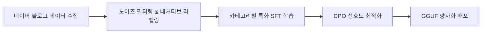
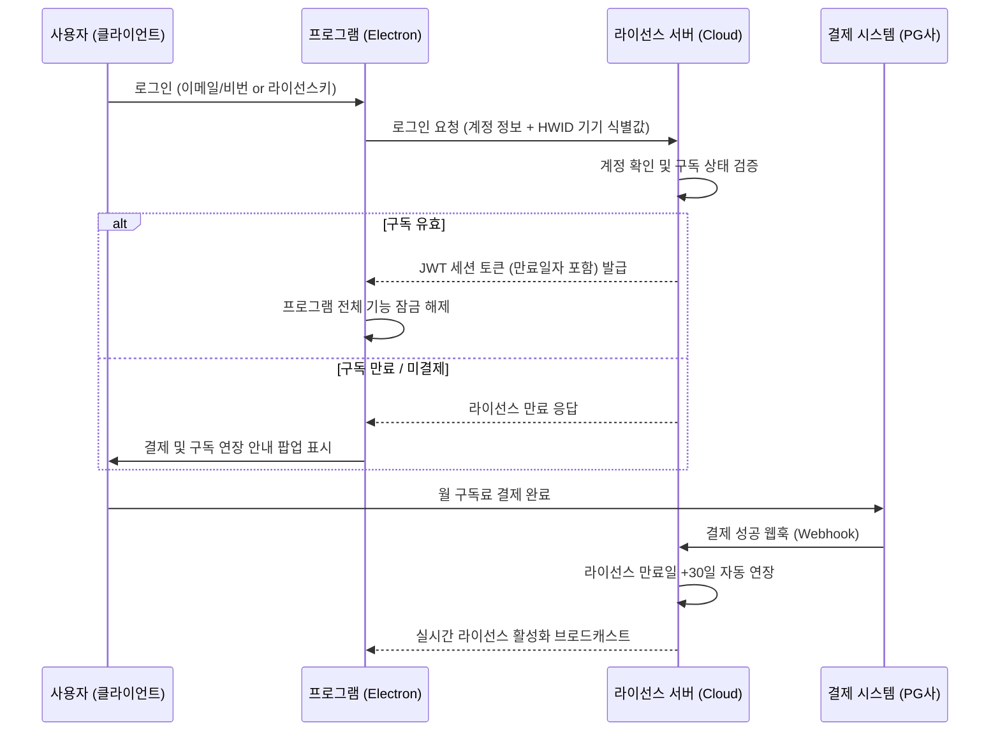

# 🚀 상용 AI 블로그 이웃 솔루션 제품화 & 개발 기획서

> **비즈니스 목표**: 크몽 1위(블로그이웃 UL, 월 25,000원) 대비 **더 저렴한 월 구독료**와 **압도적인 AI 전자동화**로 시장을 장악하는 상용 솔루션 출시  
> **핵심 차별화**: 자잘한 수동 설정을 배제한 **'1-Click AI 전자동 자율 에이전트'** + 일반 보급형 PC에서도 초고속 구동되는 **경량 특화 AI (Gemma 4 E2B 파인튜닝)**  
> **시스템 아키텍처**: 데스크톱 클라이언트(Electron) + 중앙 서버(로그인/구독결제/라이선스 관리) + 온디바이스 초경량 LLM  
> **작성 일자**: 2026년 9월 6일

---

## 1. 상용화 비즈니스 전략 & 가격 포지셔닝

### 1.1 시장 경쟁 분석 및 차별화
* **기존 시장 1위 (크몽 gig/95782 - MJsoft 블로그이웃 UL)**:
  * **가격**: 월 25,000원 / 6개월 100,000원 / 1년 180,000원 (상당한 구독 부담)
  * **한계**: 복잡한 옵션과 설정 버튼이 너무 많아 진입장벽이 높고, 댓글 생성 엔진이 단순 룰베이스나 정형화된 패턴 문구라 기계적인 느낌이 남음.
* **우리의 전략 포지셔닝**:
  * **파격적인 가성비 요금제**: **월 9,900원 ~ 14,900원** (경쟁사 대비 40~60% 저렴한 가격으로 블로거 및 부업 인구 흡수)
  * **극상의 간편함 (AI 전자동)**: 자잘한 기능 조작 없이 **[AI 전자동 시작]** 버튼 하나로 알아서 타겟팅, 포스팅 분석, 맞춤 댓글, 공감, 서로이웃, 답방까지 올인원 수행.
  * **0원 API 비용의 고지능 AI**: 구매자의 일반 PC(내장 그래픽 및 보급형 사양)에서도 부드럽게 돌아가는 **Gemma 4 E2B 맞춤 학습 모델** 내장.

### 1.2 구독 요금제 구성안
| 요금제 | 공급 가격 | 주요 제공 혜택 |
| :--- | :--- | :--- |
| **베이직 (월간)** | 월 9,900원 | AI 전자동 소통 (일 100건) + AI 답방 + 기기 1대 등록 |
| **프로 (월간)** | 월 14,900원 | AI 전자동 소통 + AI 답방 + AI 유령이웃 정리 + 실시간 트렌드 글 자동 생성 |
| **연간 VIP** | 연 99,000원 (월 8,250원꼴) | 프로 플랜 전 기능 + 우선 기술지원 + 신규 AI 파인튜닝 모델 무상 업데이트 |

---

## 2. 초경량 특화 AI 모델 (Gemma 4 E2B) 학습 및 온디바이스 서빙 전략

상용 프로그램의 핵심은 **"구매자의 PC 사양을 타지 않으면서도 인간보다 더 자연스럽고 센스 있는 댓글을 생성하는 것"**입니다.

### 2.1 왜 Gemma 4 E2B (2B급) 모델인가?
* **초경량 리소스 요구량**:
  * 모델 용량: GGUF Q4_K_M 양자화 시 **약 1.2GB ~ 1.5GB** 내외.
  * VRAM 2GB 미만 또는 외장 그래픽이 없는 일반 노트북(CPU AVX2)에서도 **0.5초 이내 초고속 추론**.
  * 서버 API(OpenAI/Claude 등) 호출 비용이 0원이므로, 월 9,900원을 받아도 마진율 95% 이상 달성 가능.

### 2.2 모델 학습(Fine-Tuning) 파이프라인



#### ① 데이터 수집 (Dataset Mining)
* **소스**: 네이버 인기 탭 및 인플루언서 블로그 게시글 10만 건 크롤링.
* **수집 데이터 쌍**: `{ 블로그 본문 핵심 요약, 카테고리, 게시글 감정/분위기 } → { 베스트 공감 댓글 }`
* **카테고리 분기**: 육아/일상, 맛집/카페, 뷰티/패션, IT/테크, 여행, 건강/생활팁 등 10대 인기 주제.

#### ② 노이즈 필터링 및 네거티브 라벨링
* **금지 문구(Negative Data) 제거 및 페널티 부여**:
  * ❌ "좋은 글 잘 보고 갑니다~ 제 블로그도 놀러오세요"
  * ❌ "유익한 정보 감사합니다. 서이추 신청해요!"
  * ❌ "포스팅 잘 보았습니다 공감 꾹 누르고 갑니다"
* **선호 문구(Positive Data) 강화**:
  * 본문 본문에 언급된 구체적 명사나 감정을 캐치하는 문장 구조 강화.
  * 예: *"오 성수동에 이런 에스프레소 바가 있었군요! 크림 라떼 비주얼이 너무 꾸덕해 보여서 이번 주말에 꼭 저장해두고 가봐야겠어요 :)"*

#### ③ 파인튜닝 기법 (SFT + DPO)
* **Unsloth 기반 LoRA SFT**:
  * Gemma 4 E2B 기본 베이스에 한국어 블로그 소통체 및 이웃 친화 톤 학습.
* **DPO (Direct Preference Optimization)**:
  * 동일한 본문에 대해 [기계적인 매크로성 답변] vs [본문 내용을 짚어주는 인간적인 감상 답변] 쌍을 구축하여, 인간적인 감상 답변에 높은 리워드를 부여하도록 가중치 최적화.

#### ④ 양자화 및 클라이언트 내장 배포
* 학습 완료된 LoRA 가중치를 베이스에 병합(Merge)한 후 **llama.cpp GGUF format (Q4_K_M)**으로 변환.
* 프로그램 최초 설치 시 1회 다운로드(약 1.3GB) 후 로컬 백그라운드 서버(`embedded-llama`)로 구동.

---

## 3. 중앙 인증 & 라이선스 서버 아키텍처

불법 복제 및 무단 배포를 원천 차단하고, 구독 결제 시 자동으로 프로그램 권한이 활성화되는 시스템입니다.



### 3.1 중앙 라이선스 서버 핵심 구성 요소
1. **사용자 및 결제 DB**:
   * `user_id`, `email`, `password_hash`, `license_status` (active, expired, trial)
   * `subscription_plan` (basic, pro, vip), `expires_at` (만료 일시)
   * `bound_hwid` (등록된 1인 1기기 고유 식별값)
2. **결제 연동 웹훅 (Webhook Receiver)**:
   * 토스페이먼츠/네이버페이 정기결제 또는 크몽 주문번호 입력 시 실시간 웹훅 수신.
   * 입금/결제 확인 즉시 `expires_at`를 +30일(또는 +365일) 자동 연장.
3. **기기 중복 방지 (HWID Fingerprinting)**:
   * 클라이언트 PC의 메인보드 UUID, CPU Serial, MAC 주소를 해싱한 고유 HWID를 생성하여 서버에 1대 바인딩.
   * 다른 PC에서 동일 계정으로 로그인 시 즉시 차단 (기기 변경은 월 1회 제한 기능 제공).

### 3.2 클라이언트 보안 & 하트비트 검증
* **암호화 통신**:
  * 서버 ↔ 클라이언트 간 모든 통신은 HTTPS / RSA 비대칭 암호화 서명 사용.
* **10분 주기 하트비트(Heartbeat)**:
  * 프로그램 실행 중 10분마다 서버에 생존 신고 및 구독 상태 갱신.
* **오프라인 유예 모드 (Grace Period)**:
  * 일시적인 인터넷 끊김이나 카페 Wi-Fi 접속 불안정을 고려해, 마지막 온라인 인증 후 최대 24시간 동안은 정상 구동 허용.

---

## 4. 제품 핵심 기능: 'AI 전자동 자율 에이전트' 중심 재설계

기존 상용 프로그램처럼 수십 개의 복잡한 체크박스와 자잘한 설정으로 사용자를 피곤하게 하지 않고, **"AI가 알아서 척척 해주는 원클릭 전자동화"**에 집중합니다.

### 4.1 🤖 1-Click AI 전자동 소통 (Auto-Pilot)
* **사용자 경험 (UX)**:
  * 사용자는 관심 주제(예: "일상, 맛집, 육아")만 고르고 **[AI 전자동 시작]** 버튼만 누르면 끝.
* **AI의 내부 자율 동작**:
  1. **타겟 자동 발굴**: 네이버 실시간 트렌드 및 추천 로직을 통해 최근 활동성이 높은 찐블로거 자동 탐색.
  2. **광고/스팸 블로그 자동 필터**: 대출, 보험, 배포 알바, 깡통 블로그를 AI가 제목/소개글을 읽고 0.1초 만에 자동 제외.
  3. **본문 문맥 & 감정 분석**: 상대방 글의 핵심 토픽과 기분(기쁨, 축하, 고민 등)을 Gemma 4 E2B가 즉각 파악.
  4. **진정성 있는 감상 댓글 작성**: 복사 붙여넣기 느낌 없는 2~3줄의 따뜻한 맞춤형 댓글 작성.
  5. **공감 및 서로이웃 신청**: 네이버 일일 안전 한도(100건)와 사람 같은 지터 딜레이(120~180초)를 지키며 자동 신청.

### 4.2 🔄 AI 자율 답방 (Smart Reciprocal Agent)
* **기능 설명**:
  * 내 블로그에 방문해 공감이나 댓글을 남겨준 사람들을 AI가 스캔.
  * 광고성 매크로 댓글은 똑똑하게 거르고, **진짜 소통하러 온 블로거의 블로그로 역방문(답방)**.
  * 상대방의 최신 글을 읽고 맞춤 댓글과 공감을 남겨 지속적인 소통 관계를 자동 형성.

### 4.3 🧹 AI 자율 이웃 정리 (Smart Diet - 5,000명 한도 관리)
* **기능 설명**:
  * 네이버의 5,000명 이웃 제한에 도달하지 않도록, **[AI 이웃 정리]** 버튼 하나로 해결.
  * **유령 블로그 정리**: 최근 60일 이상 글을 쓰지 않은 휴면 계정 자동 감지 및 정리.
  * **일방 이웃(뒷삭) 정리**: 나는 이웃인데 상대방은 나를 지운 계정 자동 색출 후 해제.
  * **미수락 신청 회수**: 내가 보낸 서로이웃 신청 중 10일 이상 상대방이 수락 안 한 대기 건들을 한 번에 취소하여 500건 신청 쿼터 복구.

---

## 5. UI/UX 화면 구성 설계안

```
+-----------------------------------------------------------------------+
|  [로고] 이웃메이트 AI (V2.0 Pro)                  [라이선스: D-28일 남음]  |
+-----------------------------------------------------------------------+
|  [대시보드]    [🤖 AI 전자동 소통]    [🔄 AI 답방]    [🧹 AI 이웃 정리]     |
+-----------------------------------------------------------------------+
|                                                                       |
|   🎯 관심 카테고리 선택: [ 맛집/카페 v ] [ 일상/생각 v ]                |
|   💬 AI 소통 어투:   (o) 친근한 이웃체  ( ) 정중한 존댓말  ( ) 열정 칭찬형   |
|                                                                       |
|   +---------------------------------------------------------------+   |
|   |                  [ 🚀 AI 전자동 소통 시작 ]                    |   |
|   +---------------------------------------------------------------+   |
|                                                                       |
|   실시간 AI 자율 소통 현황:                                             |
|   * @맛집탐험가 님의 글 분석 중... ('성수동 소금빵 카페 투어')          |
|   * [AI 댓글 생성]: "우와 갓 구운 소금빵 윤기가 장난 아니네요! ..."    |
|   * 공감(❤️) 클릭 완료 -> 🤝 서로이웃 신청 완료 (오늘 성공: 18/100)     |
|                                                                       |
+-----------------------------------------------------------------------+
```

---

## 6. 개발 로드맵 및 출시 일정 (마일스톤)

| 단계 | 기간 | 주요 개발 과제 |
| :---: | :---: | :--- |
| **Milestone 1** | 1주차 | **Gemma 4 E2B 맞춤 파인튜닝**: 데이터셋 구축, LoRA/DPO 학습, GGUF Q4_K_M 모델 변환 및 테스트 |
| **Milestone 2** | 2주차 | **중앙 라이선스 & 인증 서버 구축**: 회원가입/로그인 API, HWID 바인딩, 결제 웹훅 및 만료일 관리 |
| **Milestone 3** | 3주차 | **클라이언트 간소화 & AI 전자동화**: 복잡한 버튼 제거, 원클릭 AI 오토파일럿, AI 답방 및 이웃정리 통합 |
| **Milestone 4** | 4주차 | **클로즈드 베타 & 결제 연동 검증**: 실 결제 테스트, 저사양 PC 구동 안정성 검증 후 크몽/스마트스토어 출시 |

---

## 7. 결론

크몽 95782는 기능이 많지만 설정이 복잡하고 가격이 월 25,000원으로 부담스럽습니다.  
우리는 **"월 9,900원대의 초저가 + 1클릭 AI 전자동화 + 일반 PC에서도 날아다니는 경량 특화 AI (Gemma 4 E2B)"**의 3박자를 갖춤으로써, 복잡한 설정에 지친 블로거들을 완전히 흡수하는 독보적인 상용 SaaS 솔루션으로 자리매김할 것입니다.
